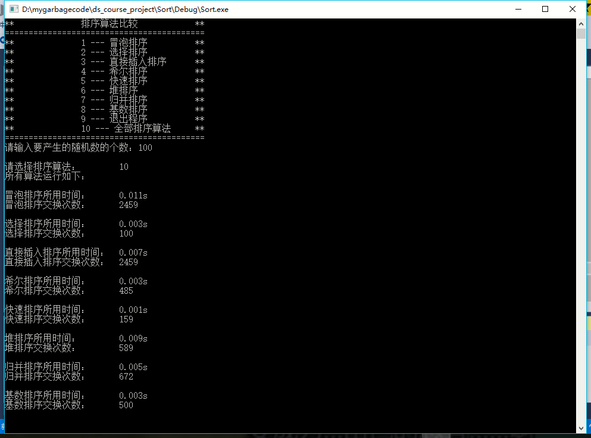
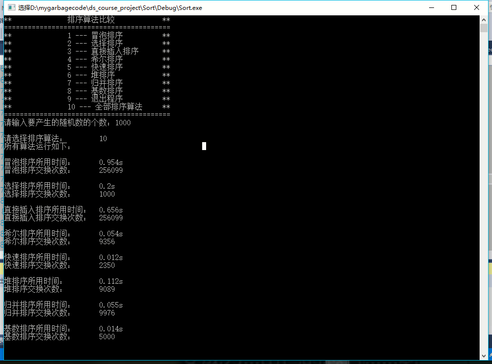
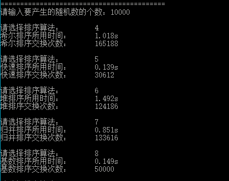
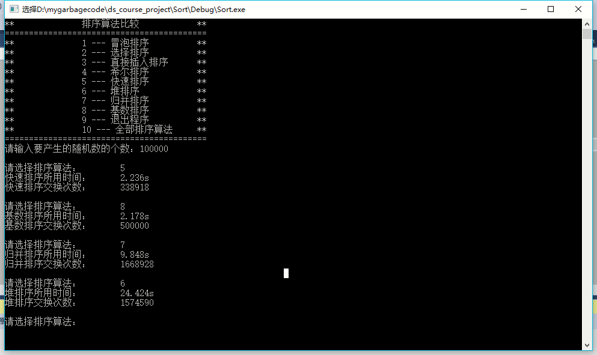

# 数据结构课程设计 项目说明文档


> ### **项目10 -- 8种排序算法的比较**
>
> 施程航
>
> 1651162


1. **需求分析**

    - 随机函数产生一百，一千，一万和十万个随机数，用快速排序，直接插入排序，冒泡排序，选择排序，希尔排序，堆排序，归并排序，基数排序共8种排序方法排序，并统计每种排序所花费的排序时间和交换次数。其中，随机数的个数由用户定义，系统产生随机数。并且显示他们的比较次数。

    - 请在文档中记录上述数据量下，各种排序的计算时间和存储开销，并且根据实验结果说明这些方法的优缺点。


2. **功能分析**
    - 实现8种排序算法
    - 接受用户输入的随机数个数输入，计算排序所用时间和交换次数

3. **设计概要**
    - 泛化迭代器类型，使之能对多种迭代器类型工作，基本上所有算法都可支持**随机访问迭代器**和**原生指针**，部分支持**双向迭代器**或**前向迭代器**
    - 交换次数的计算可以用一个`static`的变量来进行计数，对其他文件提供相应接口访问。交换次数的递增在自定义的`swap`实现，递增后把交换的逻辑交给`std::swap`

        ```c++
        //自定义的swap
        void swap(int &a, int&b)
        {
            ++__swap_times__;
            //转为调用std::swap
            std::swap(a, b);
        }
        ```

    - 时间的计算调用`clock()`接口即可

4. **具体实现**

    **注：下面空间复杂度指额外所需的空间大小**
    - **冒泡排序**

        |稳定性|渐近时间复杂度|空间复杂度|
        |-|-|-|
        |稳定|O(n*n)|O(1)|

        ```c++
        //冒泡排序
        template<class It>
        void bubble_sort(It first, It last)
        {
            //auto beg = first++;
            //冒泡次数为迭代器范围内的元素数量-1
            while (first < --last) {
                for (auto it = first;it != last;++it) {
                    if (*it > *(it + 1)) {
                        swap(*it, *(it + 1));
                    }
                }
            }
        }
        ```

    - **选择排序**

        |稳定性|渐近时间复杂度|空间复杂度|
        |-|-|-|
        |稳定|O(n*n)|O(1)|

        ```c++
        //选择排序
        template<class It>
        void select_sort(It first, It last)
        {
            //在cur_position之前的元素均有序
            //auto beg = first;
            //typedef typename It::value_type value_type;
            while (first != last) {
                It smallest = first;
                for (auto it = first;it != last;++it) {
                    if (*smallest > *it) {
                    smallest = it;
                    }
                }
                swap(*smallest, *first++);
            }
        }
        ```

    - **插入排序**

        |稳定性|渐近时间复杂度|空间复杂度|
        |-|-|-|
        |不稳定|O(n*n)|O(1)|

        ```c++
        template<class It>
        void insert_sort(It first, It last)
        {
            if (first == last)return;
            auto beg = first++;

            while (first != last) {
                auto temp = *first;
                for (It it = first;it != beg;--it) {
                    if (*(it - 1) <= temp)break;
                    else ::swap(*(it - 1), *it);
                }

                ++first;
            }
        }
        ```

    - **希尔排序**
        希尔排序的时间复杂度主要和选取的增量序列有关，在这里选取了[Pratt](https://en.wikipedia.org/wiki/Vaughan_Pratt)于1971年提出的公式，`gap = (3^k - 1) / 2, k = 1,2,3...,gap <= n/3`，在此公式下的希尔排序：

        |稳定性|`最坏情况下`的时间复杂度|空间复杂度|
        |-|-|-|
        |不稳定|O(n^1.5)|O(1)|

        ```c++
        //希尔排序
        //希尔排序只支持随机迭代器
        template<class It>
        void shell_sort(It first, It last)
        {
            int delta_index = -1;
            int num = (last - first);
            for (;__shell_steps__[delta_index + 1] < num / 3;++delta_index);

            int delta;
            //每步的增量必须大于1
            while (delta_index>=0) {
                delta = __shell_steps__[delta_index];

                for (int i = delta;i < num;++i) {
                    if (*(first + i) >= *(first + (i - delta)))continue;
                    //else
                    auto temp = *(first + i);
                    for (int j = i - delta;j >= 0;j -= delta) {
                        if (temp < *(first + j))
                        ::swap(*(first + j + delta), *(first + j));
                        else break;
                    }
                }
                delta_index--;
            }
        }
        ```

    - **快速排序**

        |稳定性|平均时间复杂度|空间复杂度|
        |-|-|-|
        |不稳定|O(n*lgn)|O(1)|

        ```c++
        //快速排序
        //支持双向访问迭代器
        template<class It>
        void quick_sort(It first, It last)
        {
            /*
            循环不变量为：忽略it后的元素split_pos是key值应该插入的位置
            */
            if (first == last || first + 1 == last) {
            return;
            }
            //
            auto key = *first;

            auto split_pos1 = ::partition(first, last, [key](const auto& elem) {return elem < key;});
            auto split_pos2 = ::partition(split_pos1, last, [key](const auto& elem) {return elem == key;});

            quick_sort(first, split_pos1);
            quick_sort(split_pos2, last);
        }
        //
        //partition
        template<class It, class UnaryPred>
        It partition(It first, It last, UnaryPred pred)
        {
            for (;;) {
                for (;;) {
                    if (first == last)
                        return first;
                        if (!pred(*first))
                        //跳出时first指向的元素大于key值
                        break;
                        ++first;
                }
                do {
                    --last;
                    if (first == last)
                        return first;
                } while (!(pred(*last)));

                ::swap(*last, *first++);
            }
        }
        ```

    - **堆排序**

        |稳定性|时间复杂度|空间复杂度|
        |-|-|-|
        |不稳定|O(n*lgn)|O(1)|

        ```c++
        //堆排序
        //只支持随机访问迭代器
        template<class It>
        void heap_sort(It first, It last)
        {
            __build_heap__(first, last);
            auto num = last - first;
            for (int i = 0;i < num - 1;++i) {
                __extract_heap__(first, last - i);
            }
        }

        //最大堆
        template<class It>
        void __adjust_heap__(It pos, It first, It last)
        {
            auto index = pos - first + 1;
            auto len = last - first + 1;

            while (index * 2 < len) {
                auto bigger_son = index * 2;
                if (index * 2 + 1 < len&&*(first + index * 2 + 1 - 1) > *(first + index * 2 - 1)) {
                    bigger_son += 1;
                }
                //auto next_index = -1;
                if (*(first + bigger_son - 1) > *(first + index - 1)) {
                    swap(*(first + bigger_son - 1), *(first + index - 1));
                    index = bigger_son;
                }
                else {
                    return;//???
                }
            }
        }


        //取出堆中最大的元素即堆顶，将其放在末尾位置并进行调整
        template<class It>
        void __extract_heap__(It first, It last)
        {
            swap(*first, *(last - 1));
            __adjust_heap__(first, first, last - 1);
        }

        //建立最大堆
        template<class It>
        void __build_heap__(It first, It last)
        {
            auto len = last - first + 1;

            for (auto begin = len / 2;begin > 0;--begin) {
                __adjust_heap__(first + (begin - 1), first, last);
            }
        }
        ```

    - **归并排序**

        |稳定性|时间复杂度|空间复杂度|
        |-|-|-|
        |稳定|O(n*lgn)|O(n)|

        ```c++
        template<class It>
        void merge_sort(It first, It last)
        {
            if (first == last || first == last - 1) {
                return;
            }

            auto len = last - first;

            merge_sort(first, first + len / 2);
            merge_sort(first + len / 2, last);

            std::vector<It::value_type> temp(len, 0);

            __merge__(first, first + len / 2, first + len / 2, last, temp.begin());

            auto src = temp.begin();
            for (auto it = first;it != last;++it) {
                swap(*it, *src++);
            }
        }

        template<class It>
        void __merge__(It first1, It last1, It first2, It last2, It dest)
        {
            while (first1 != last1 && first2 != last2) {
                if (*first1 < *first2) {
                    *dest++ = *first1++;
                }
                else {
                    *dest++ = *first2++;
                }
            }
            while (first1 != last1) {
                *dest++ = *first1++;
            }
            while (first2 != last2) {
                *dest++ = *first2++;
            }
        }
        ```

    - **基数排序**

        基数排序的时间复杂度除了跟序列的长度有关还和数字的位数有关，时间复杂度小于`10*n`
        |稳定性|时间复杂度|空间复杂度|
        |-|-|-|
        |稳定|？|O(n)|

        ```c++
        //基数排序
        template<class It>
        void radix_sort(It first, It last)
        {
            typedef typename It::value_type value_type;
            std::vector<value_type> bukects[10];

            int max_num = -1;
            for (auto it = first;it != last;++it) {
                if (*it > max_num)max_num = *it;
            }
            int max_bit = 0;
            while (max_num != 0) {
                max_num /= 10;
                ++max_bit;
            }

            //int max_bits = -1;
            for (int cur_bit = 0;cur_bit < max_bit;++cur_bit) {
                for (auto it = first;it != last;++it) {
                    bukects[get_bit(*it, cur_bit)].push_back(*it);
                    //swap(int a(), int b());
                }
                auto beg = first;
                for (int bucket_i = 0;bucket_i < 10;++bucket_i) {
                    for (auto &x : bukects[bucket_i]) {
                        swap(*beg++, x);
                    }
                    bukects[bucket_i].clear();
                }
            }
        }

        //取出num对应bit位上的数，bit=0表示个位，依次类推
        int get_bit(int num, int bit);
        ```

5. **测试与分析**
    - **测试数据**
        - 随机数数量100：

            

        - 随机数数量1000:

            

        - 随机数数量10000:

            

            在随机数数量为10000时冒泡排序、直接插入排序、选择排序时间均过长，跟其他算法不是一个数量级。

        - 随机数数量为100000:

            
            在随机数数量为100000时希尔排序明显很吃力
    - 随机数基于`<cstdio>`的`rand()`产生，属于伪随机数，使用`srand(time(NULL))`播种 `rand()` 所用的伪随机数生成器。`rand()`返回值在`1-RAND_MAX`之间，在本地的`stdlib.h`中RAND_MAX声明如下：

        ```c++
        // Maximum value that can be returned by the rand function:
        #define RAND_MAX 0x7fff
        ```

    - 在测试中可以看到，直接插入排序、冒泡排序、选择排序适用于较小的数组，实现也较为简单，在对数据长度10000的序列进行排序时，O(n*n)已经开始有点吃力。当然，直接插入排序我们可以采用折半插入进行优化。另外，选择排序在100和1000的测试中时间和交换次数相比其他两种排序都有优势
    - 对于希尔排序，对大小10000的序列尚能很好工作，对于大小100000已经与其他排序拉开差距，因其**最坏时间复杂度**为O(n^1.5)
    - 可以看到，对于100，1000，10000，100000大小的序列，快速排序、基数排序、合并排序和堆排序都能较好工作。
    - 堆排序到100000略显吃力的原因很可能是因为其要对数据进行预处理，即一开始的**建堆动作**(`build_heap`)
    - 基数排序在我们的测试均能很好工作，并且其交换次数跟序列大小成正比。鉴于`RAND_MAX`的大小可以得知，我们的数据最大实际上只有5位，所以理论上可以认为基数排序有着接近线性的时间复杂度，但对不限制大小的数据集，那么基数排序在此实验中的效果可能有所折扣。另外，基数排序有一个缺点是对**浮点数**无能为力，除非做一些预处理的工作，这也对其应用推广有所阻碍，额外的不小空间消耗也是其缺点之一。
    - 归并排序在测试中表现也不错，额外的存储是其缺点之一，不过对于链表的归并排序而言其实并不需要额外的存储空间
    - 快排在测试中一直保持着较为稳定的性能。枢纽值的选取影响着快排分割序列的合理性，这对其时间复杂度影响极为重大。理论上重复数据对快排不是很友好，可以想象极端情况下一个值完全相同的序列，对于不额外考虑重复数据较多的快排实现，分割极不均匀，此外，重复数据被选为枢纽容易产生重复数据频繁交换位置。为此我们的实现选择多扫描后半段以使得序列被切割为三段，与枢纽值相同的数据直接被分成中间的一段，不参与下一次排序：

        ```c++
        auto key = *first;

        auto split_pos1 = ::partition(first, last, [key](const auto& elem) {return elem < key;});
        auto split_pos2 = ::partition(split_pos1, last, [key](const auto& elem) {return elem == key;});

        quick_sort(first, split_pos1);
        quick_sort(split_pos2, last);
        ```

    从测试结果可以看出，即使对于伪随机数这种范围有限、易产生重复数据的序列，这样的决策的平均复杂度也是较不错的。快排稳定的性能是其得以广泛应用的关键。