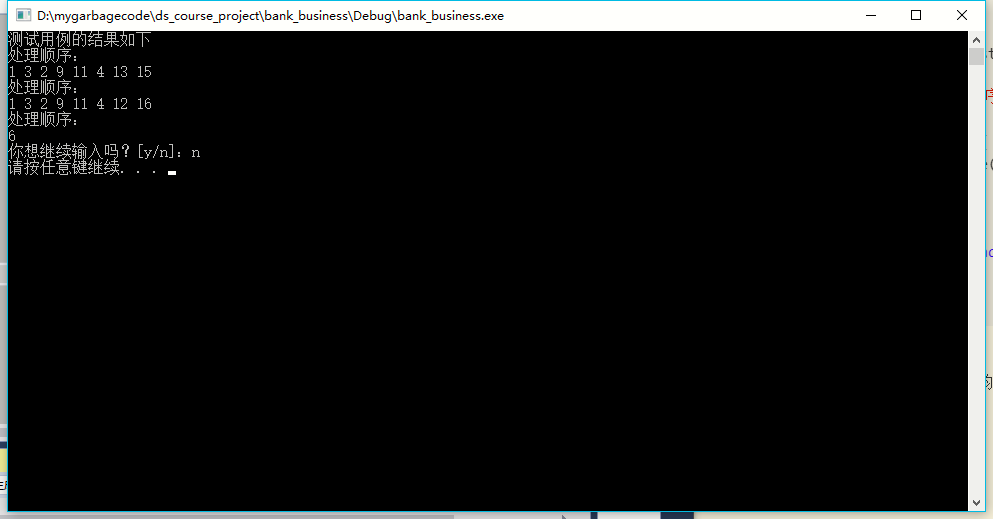
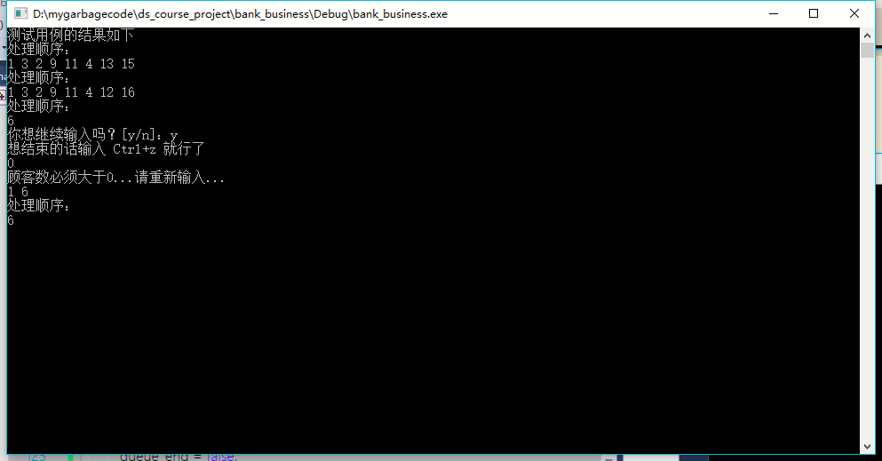

# 数据结构课程设计 项目说明文档


> ### **项目5 -- 银行业务**
>
> 施程航
>
> 1651162

1. **项目介绍**
    - 本项目是对银行业务的简单模拟。设某银行有A，B两个业务窗口，且处理业务的速度不一样，其中A窗口处理速度是B窗口的2倍----即当A窗口每处理完2个顾客是，B窗口处理完1个顾客。给定到达银行的顾客序列，请按照业务完成的顺序输出顾客序列。假定不考虑顾客信后到达的时间间隔，并且当不同窗口同时处理完2个顾客时，A窗口的顾客优先输出。
    - 输入说明：输入为一行正整数，其中第一数字N（N<=1000）为顾客总数，后面跟着N位顾客的编号。编号为奇数的顾客需要到A窗口办理业务，为偶数的顾客则去B窗口。数字间以空格分隔。
    - 输出说明：按照业务处理完成的顺序输出顾客的编号。数字键以空格分隔，但是最后一个编号不能有多余的空格。
    - 测试用例：

        |序号|输入|输出|说明|
        |-|-|-|-|
        |1|8 2 1 3 9 4 11 13 15|1 3 2 9 11 4 13 15|正常测试，A窗口人多|
        |2|8 2 1 3 9 4 11 12 16|1 3 2 9 11 4 12 16|正常测试，B窗口人多|
        |3|1 6|6|最小N|

2. **整体描述**

    - 由于相同窗口业务处理的顺序是先来先处理，故可采用队列。这里用`using queue = std::queue<int>`进行声明。
    - 在模拟时如果想要简化逻辑，完全可以先把输入的序列先行划分至对应的两个窗口，然后再模拟时间进行处理即可，这样会带来一定的性能损耗，这主要是出入队列引起的。如果一边读入一边输出，那么可以避免**部分**编号出入队列。
    - 在这里需要注意的是，队列充当的更多是**缓冲区**这一角色。也就是说，有一些顾客编号是必须先进入队列的，比如一个序列`1 3 5 7 8`，根据题意，输出顺序是`1 3 8 5 7`，`5 7`在`8`输出前就需要有个缓冲区进行暂时的存储，这正是`queue`在这里的作用。 
3. **设计概要**
    - **银行类**
        - bank类包含了项目的主要逻辑，包含了一系列的接口对银行业务进行模拟。
        - **类成员(函数)**

            |成员(函数)|可访问性|具体描述|
            |-|-|-|
            |int customers|private|外部输入的编号序列总长度，也即顾客数量|
            |bool queue_end|private|判断当前的一个序列是否已经处理结束，若结束则进行下一次处理|
            |queue win_a, win_b|private|分别是窗口a b的队列|
            |int not_output_cus|private|判断是否已经到达末尾，目的是让最后一个顾客编号后不输出空格|
            |bank()|public|构造函数|做相应的初始化|
            |void process_once(std::istream& in)|private|单位时间执行的动作，调用对应函数实现两个窗口单位时间内处理业务的逻辑|
            |void process_one_win(std::istream& in, queue& cur_win, queue& ano_win, int times, int flag)|private|实现单个窗口单位时间内处理业务的逻辑|
            |void process(std::istream& in)|public|供外部调用，处理一个外部输入的顾客编号序列|

4. **具体实现**
    - **处理一个窗口**
        - 由题意可知，单位时间内实际上两个窗口的输出是完全没有交叉的，所以可以把单位时间一个窗口处理业务的逻辑抽象出来，用处理业务的速度以及奇偶编号做参数的泛化，从而达到代码的复用
        - 这里在最后一个while循环做了是否已经读入所有顾客编号的判断，若是，则当前正在处理的窗口缓冲区即对应的队列的人数不足，并且为了补足人数，已经使得序列为空，这时候说明当前窗口已经没有需要处理的顾客，故只要把另一个窗口的顾客编号全部按序输出即可。
        ```c++
        void bank::process_one_win(std::istream& in, queue& cur_win,queue& ano_win,int times,int flag)
        {
            using std::cout;

            while (times > 0 && !cur_win.empty()) {
            cout << cur_win.front() << seperator();--times;
            cur_win.pop();
            }

            int num = -1;
            while (times > 0 && customers > 0) {
		        in >> num;--customers;
		        if (num % 2 == flag) {
			        cout << num << seperator();
			        --times;
		        }
		        else {
			        ano_win.push(num);
		        }
	        }
	        if (customers <= 0) {
		        queue_end = true;
		        while (!ano_win.empty()) {
			        cout << ano_win.front() << seperator();
			        ano_win.pop();
		        }
	        }
        }
        ```
    - **模拟单位时间内银行窗口的业务执行**
        - 可以看到，有了单个窗口单位时间业务逻辑的抽象，模拟银行单位时间的业务执行十分简单。
        ```c++
        void bank::process_once(std::istream& in)
        {
	        process_one_win(in, win_a, win_b, 2, 1);
	        process_one_win(in, win_b, win_a, 1, 0);
        }
        ```
    - **处理多个顾客编号序列**
        - 嵌套的两层循环是为了处理多个顾客序列的输入，当处理完一个顾客编号序列即把queue_end置为true，随后继续进行下一个顾客序列的处理。
        ```c++
        void bank::process(std::istream& in)
        {
	        while (in >> customers) {
		        /*
		        奇妙的是如果把上面while里面的语句改为in，然后不注释下面的语句，那么会多输出一个“处理顺序”。其实就是多做了一次while循环，虽然循环内什么也没能输出，因为customers为0并且队列a b 都为空

		        总结就是：得读到eof（下一个才是eof就不管了）才能触发输入流的fail?位置位，从而使while判断失败
		        */
		        //in >> customers;
		        not_output_cus = customers;

		        std::cout << "处理顺序：" << std::endl;

		        while (!queue_end) {
			        process_once(in);
		        }
		        queue_end = false;
		
		        std::cout << std::endl;
	        }
        }
        ```
    - **防止末尾输出多余空格**
        - 当输出一个编号就把未输出顾客的数量减一，当其等于0就不再输出空格。
        ```c++
        std::string bank::seperator()
        {
	        return --not_output_cus == 0 ? "" : " ";
        }
        ```
    - **测试结果**
        - 经测试验证，要求用例的输出均符合预期：

            
5. **鲁棒性测试**
        
    - **当输入的顾客数小于0**

        
