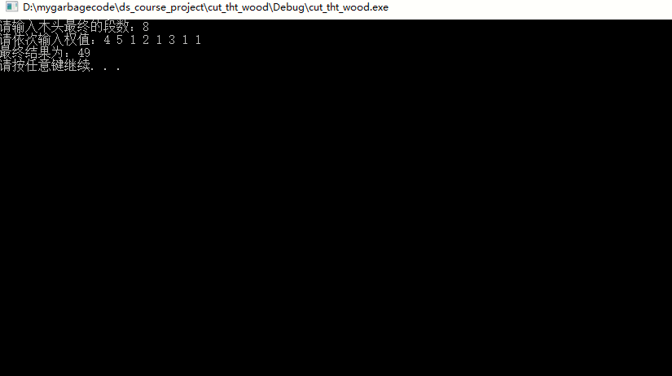

# 数据结构课程设计 项目说明文档


> ### **项目7 -- 修理牧场**
>
> 施程航
>
> 1651162


1. **需求分析**
    - **项目背景**
        - 农夫要修理牧场的一段栅栏，他测量了栅栏，发现需要N块木头，每块木头长度为整数Li个长度单位，于是他购买了一个很长的，能锯成N块的木头，即该木头的长度是Li的总和。
        - 但是农夫自己没有锯子，请人锯木的酬金跟这段木头的长度成正比。为简单起见，不妨就设酬金等于所锯木头的长度。例如，要将长度为20的木头锯成长度为8，7和5的三段，第一次锯木头将木头锯成12和8，花费20；第二次锯木头将长度为12的木头锯成7和5花费12，总花费32元。如果第一次将木头锯成15和5，则第二次将木头锯成7和8，那么总的花费是35（大于32）。
    - **项目需求**
        - 对于一块总长L的木头，如何对它进行切割从而得到若干段特定长度的木头且使得酬金最少

2. **功能分析**
    - 假设需要N块木头，每块木头长度为Li(i = 1,2,3...n)，初始时木头只有一块长度为L的木头，`L = ΣLi,i = 1,2,3,...n`。每次切割会让一块木头一分为二，如果得到的木头长度符合需求，那么我们把我们的工作缩小至把剩下的木头切割出来。
    - 可以发现，一块木头如果越晚切割出来，那么其在**酬金的累积**上的**贡献**就会越大。实质上**在最小酬金的前提下**切割木头的过程正是**构造哈夫曼树的逆过程**，那么为了计算出最小酬金，我们只需要构造哈夫曼树，求出**非叶节点的权值之和**即可。
    - 输入格式：输入第一行给出正整数N（N < 10^4），表示要将木头锯成N块。第二行给出N个正整数，表示每块木头的长度。
    - 输出格式：输出一个整数，即将木头锯成N块的最小花费。
    - 测试用例：
        ```
        8
        4 5 1 2 1 3 1 1
        ```
    - 测试结果符合预期
        

3. **设计概要**
    - **`node`类设计**
        - `node`类是哈夫曼树的节点类。
        - **`node`类成员(函数)概览**
            
            |类成员(函数)|可访问性|具体描述|
            |-|-|-|
            |link_type left|private|左孩子|
            |link_typeright|priavte|右孩子|
            |int weight|private|节点的权值|
            |struct cmp{}|public|作为构建哈夫曼树时优先队列的比较函数|
            |int get_weight()|public|提供外部访问私有变量weight的接口|
            |node(int _weight, link_type _left = nullptr, link_type _right = nullptr)|public|构造函数，作相应的初始化|
            |~node()|public|析构函数，递归地释放左右子节点的内存|
            |static node* make_node(link_type left, link_type right)|public|静态成员函数，主要是提供给`hfm_tree`类通过两个节点生成新节点的接口|
    - **`hfm_tree`类设计**
        - `hfm_tree`类接受外部输入并生成哈夫曼树，计算总权值即题目所求的最小薪酬。
        - **`hfm_tree`类成员(函数)概览**
            |类成员(函数)|可访问性|具体描述|
            |-|-|-|
            |std::priority_queue<link_type,std::vector<link_type>,node::cmp> pq|private|存储哈夫曼树的节点，优先队列的特性使得我们可以快速取出最小的两个节点|
            |int n|private|初始节点总数量|
            |link_type root|private|哈夫曼树的根节点，便于后续释放所有节点的内存|
            |int sum|private|在构建的过程中累积总酬金|
            |void build_tree()|private|构建哈夫曼树|
            |int get_sum()|public|调用`build_tree`，返回总酬金|
            |vois clear_current_hfm()|public|摧毁当前哈夫曼树中的所有节点，应该在build_tree后运行|
            |template< class It > void set_leaves(It first,It last)|public|接受一对迭代器，读取该容器中的初始叶节点权值，并初始化优先队列|
            |hfm_tree()|public|默认构造函数|
            |template< class It > hfm_tree(It first,It last)|public|调用默认(委托)构造函数初始化，再调用`set_leaves`初始化优先队列|
            |~hfm_tree()|public|析构函数，递归释放树中节点内存|

4. **具体实现**
    - **`node`类接口实现**
        - **获得权值**
            ```c++
            int get_weight() { return weight; }
            ```
        - **仿函数实现比较函数**
            - 这是优先队列判断权值大小的依据
            ```c++
            struct cmp {
	    	bool operator()(const link_type l, const link_type r) {
	    		return l->weight > r->weight;
	    	}
            ```
        - **构造/析构函数**
            ```c++
            node(int _weight, link_type _left = nullptr, link_type _right = nullptr):weight(_weight),left(_left),right(_right){}
	        ~node() {
            #ifdef DEBUG
		        std::cout << "我被析构了！" << std::endl;
            #endif // DEBUG

		        if (left != nullptr)delete left;
		        if (right != nullptr)delete right;
	        }
            ```
        - **通过两个节点创建新的节点**
            ```c++
            static node* make_node(link_type left, link_type right)
	        {
		        auto new_node = new node(left->weight + right->weight, left, right);
		        if (new_node == nullptr)
		        {
			        std::cout << "申请节点时内存出错！" << std::endl;
		        }
		        return new_node;
                }
            ```
            静态成员函数`make_node`主要是为了方便`hfm_tree`类建树过程中合并两个节点从而获得一个新节点。

    - **`hfm_tree`类接口设计**
        - **构建哈夫曼树**
            ```c++
            void hfm_tree::build_tree()
            {
	            assert(n == pq.size());

	            while (pq.size() > 1) {
		            auto left = pq.top();
		            pq.pop();
		            auto right = pq.top();
		            pq.pop();

		            sum += left->get_weight() + right->get_weight();//在构建哈夫曼树的同时累积权值

                #ifdef DEBUG
		            std::cout << "left -> " << left->get_weight() << "   right -> " << right->get_weight() << std::endl;
		            std::cout << "left address -> " << left << "   right address -> " << right << std::endl;
                #endif // DEBUG


		            pq.push(node::make_node(left, right));
	            }

	            root = pq.top();
            }
            ```
            建树的过程中直接累积权值，可以提升程序性能
        - 获得酬金**
            ```c++
            int hfm_tree::get_sum()
            {
	            build_tree();

	            return sum;
            }
            ```
        - **清空所有节点**
            - 清除哈夫曼树中的所有节点
            ```c++
            void hfm_tree::clear_current_hfm()
            {
	            if (root == nullptr)return;
	            else delete root;
            }
            ```
        - **初始化优先队列**
            ```c++
            template <class It>
	        void set_leaves(It first, It last)
	        {
		        for (auto it = first;it != last;++it) {
			        pq.push(new node(*it));
			        ++n;
		        }
	        }
            ```
        - **构造函数**
            - 重载了两个版本，带参数的构造函数会调用默认构造函数作为委托构造函数，并调用`set_leaves`通过读取迭代器的内容进行优先队列的初始化
            ```c++
            template<class It>
	        hfm_tree(It first,It last):hfm_tree(){
            #ifdef DEBUG
		        if(root == nullptr)cout << n << " " << sum << std::endl;
            #endif // DEBUG

		        set_leaves(first, last);
	        }
	        hfm_tree():root(nullptr), n(0), sum(0){}
            ```
        - **析构函数**
            ```c++
	        ~hfm_tree() {
		        clear_current_hfm();
	        }
            ```
5. **优化**
    - 前面谈到，我们可以在构建哈夫曼树的过程中累积权值，如果我们只是单单想计算出最小酬金，那么我们可以不用建树，也就是说没有`node`这一层抽象，原因是我们**并不需要节点与节点之间的父子关系**，在累积的过程中我们已经得到了想要的信息即**叶节点被累积的次数乘以其权值之和**。如果把`node`类省掉可以大大节约程序所用内存和时间。