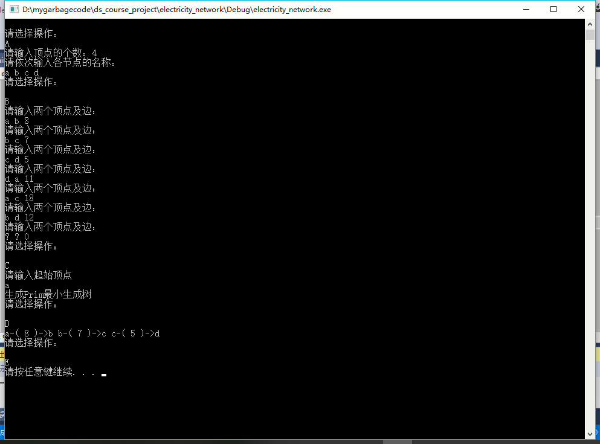
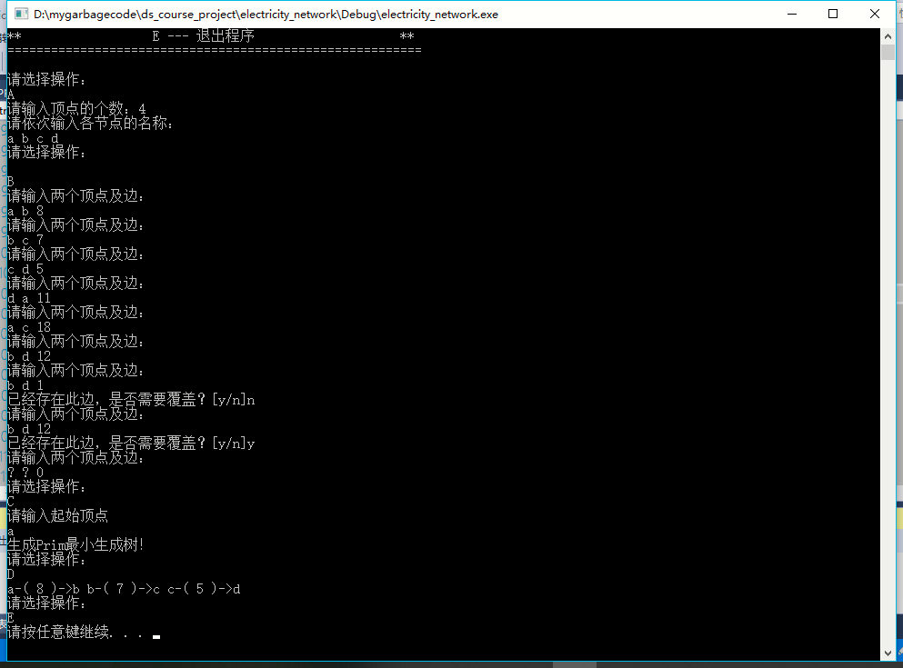
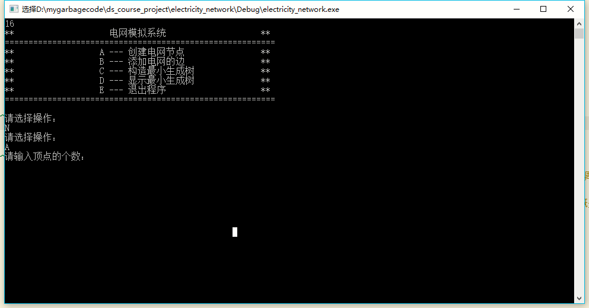

# 数据结构课程设计 项目说明文档


> ### **项目8 -- 电网建设造价模拟系统**
>
> 施程航
>
> 1651162


1. **项目介绍**
    - 假设一个城市有n个小区，要实现n个小区之间的电网都能够相互接通，构造这个城市n个小区之间的电网，使总工程造价最低。请设计一个能够满足要求的造价方案。
    - 要求在每个小区之间都可以设置一条电网线路，都要付出相应的经济代价。n个小区之间最多可以有n（n-1）/2条线路，选择其中的n-1条使总的耗费最少。
    - 测试用例：
        ```c++
        A
        4
        a b c d

        B
        a b 8
        b c 7
        c d 5
        d a 11
        a c 18
        b d 12
        ? ? 0

        C
        a

        D

        E
        ```
        - **测试结果**

            

2. **整体描述**
    - 建造电网使n个小区均能连通并且总工程造价最低即路径总长最短，采用Prim最小生成树算法进行求解。Prim最小生成树算法是一种贪心算法。
    

3. **设计概要**
    - **类设计**
        - edge类
            - 自定义类型，节点与节点之间边的抽象。
        - solver类实现了创建节点、添加电网的边、构建最小生成树、显示最小生成树的功能，功能的抽象使得使用较为简单。
        - **类成员(函数)**

            |类成员(函数)|可访问性|具体描述|
            |-|-|-|
            |std::vector< edge > tree|private|存储Prim最小生成树的边|
            |std::vector< int > dist_to_tree|private|节点未进入生成树时距离树的距离|
            |std::vector< int > visited|private|标志节点是否被访问过|
            |std::vector< int > parent|private|标记节点在树中的父亲节点|
            |std::vector< vector < int >> dist|private|存储节点两两之间的距离|
            |std::map< std::string, int> key_to_num|private|从节点的名字映射到编号，便于后续处理|
            |std::vector< std::string > num_to_key|private|从节点的编号映射到节点的名字，以便打印|
            |int root|private|生成树的根节点|
            |int n|private|节点数量|
            |void create_vertices(std::istream& in)|public|接受输入创建节点，做相应的初始化|
            |void add_edges(std::istream& in)|public|接受输入创建边|
            |void gen_prim_tree(std::istream& in)|public|运行Prim算法生成最小生成树|
            |void print_prim_tree()|public|按照加入生成树的顺序依次打印最小生成树的各条边|

4. **具体实现**
    - **创建节点**
        ```c++
        void solver::create_vertices(std::istream& in)
        {
	        std::cout << "请输入顶点的个数：";
	        in >> n;
	
	        dist.assign(n, std::vector<int>(n, -1));
	        //num_to_key.assign(n, "");

	        std::cout << "请依次输入各节点的名称：" << std::endl;

	        std::string name;
	        int num = 0;
	        key_to_num.clear();
	        while (num<n) {
		        in >> name;
		        key_to_num.emplace(name, num);
		        num_to_key.push_back(name);
		        ++num;	//分配编号
        #ifdef DEBUG
		        std::cout << key_to_num[name];
        #endif // DEBUG
	        }
        }
        ```
        - 读入节点个数n，并依次读入各个节点的名字，同时初始化两个映射数组num_to_key和key_to_num。

    - **加入边**
        ```c++
        void solver::add_edges(std::istream& in)
        {
	        std::string u, v;
	        int cost;
	
	        while (true) {
		        std::cout << "请输入两个顶点及边：" << std::endl;
		        in >> u >> v >> cost;
		        if (u[0] == '?')break;
		
		        if (dist[key_to_num[u]][key_to_num[v]] != -1) {
			        std::cout << "已经存在此边，是否需要覆盖？[y/n]";
			        char response;
			        std::cin >> response;
			        while (response == '\n')std::cin >> response;
			        if (response != 'Y' || response != 'y')continue;
		        }

		        dist[key_to_num[u]][key_to_num[v]] = cost;
		        dist[key_to_num[v]][key_to_num[u]] = cost;
	        }
	
        }
        ```
        - 读入节点和节点之间的距离，初始化距离数组dist。

    - **运行Prim算法构建最小生成树**
        ```c++
        void solver::gen_prim_tree(std::istream& in)
        {
	        std::cout << "请输入起始顶点" << std::endl;

	        std::string vertex_name;
	        in >> vertex_name;
	        root = key_to_num[vertex_name];

	        //保持数组的状态均回到最初
	        tree.clear();
	        dist_to_tree.assign(n, -1);
	        visited.assign(n, 0);
	        parent.assign(n, root);

	        //parent[root] = root;
	        visited[root] = 1;

	        /**/
	        for (int i = 0;i < dist_to_tree.size();++i) {
		        dist_to_tree[i] = dist[i][root];
	        }
	        dist_to_tree[root] = 0;

	        int times = dist_to_tree.size() - 1;//循环执行 n - 1次
	        while (times-- > 0) {
		        int nearest_ver = -1, shortest_len = (1 << 30);
		        //找出当前离root最近的未访问的节点
		        for (int i = 0;i < dist_to_tree.size();++i) {
			        if (dist_to_tree[i] != -1 && shortest_len > dist_to_tree[i]
				        && visited[i] == 0) {
				        nearest_ver = i;
				        shortest_len = dist_to_tree[i];
			        }
		        }
		
		        assert(nearest_ver != -1);
		        //将节点加入已访问集合
		        visited[nearest_ver] = 1;
		        //把边加入最小生成树
		        tree.emplace_back(parent[nearest_ver], 
										nearest_ver, 
										dist[parent[nearest_ver]][nearest_ver]);

		        for (int i = 0;i < dist_to_tree.size();++i) {
			        if (visited[i] == 0 &&																			//节点未被访问过
				        dist[i][nearest_ver] != -1 &&															//两节点的距离不为无穷大
				        dist_to_tree[i] > dist[i][nearest_ver]												//距离生成树更近了...
				        ) {
				        dist_to_tree[i] = dist[i][nearest_ver];
				        parent[i] = nearest_ver;
			        }
		        }
	        }

	        std::cout << "生成Prim最小生成树" << std::endl;
        }
        ```
        - **算法执行过程**
            - a. 将根节点加入集合，初始化dist_to_tree，使得`root`的相邻节点到生成树的距离为其到`root`的距离。
            - b. 遍历节点，选择未加入生成树的点中距离生成树最近的点作为下一个加入的点，记为`p`，将连接生成树和`p`节点的边加入生成树。同时如果`p`的相邻节点到`p`的距离小于其到生成树的当前距离，即进行更新。
            - c. 重复步骤b(n-1)次，即可以得到最小生成树。

    - **打印最小生成树**
        ```c++
        void solver::print_prim_tree()
        {
	        for (auto& x : tree) {
		    std::cout << num_to_key[x.u] << "-( " << x.cost << " )->" << num_to_key[x.v] << " ";
	        }
	        std::cout << std::endl;
        }
        ```
        - 按照要求格式对生成树进行打印。

5. **鲁棒性测试**
    - 输入重复的边
        - 测试样例
            ```c++
            A
            4
            a b c d

            B
            a b 8
            b c 7
            c d 5
            d a 11
            a c 18
            b d 12
            b d 1
            n
            b d 12
            y
            ? ? 0

            C
            a

            D

            E
            ```
        - 测试结果
            

    - 忽略不存在的命令

        
        
6. **优化**
    - 可使用最小堆，从而提升程序的性能。在加入一个新节点后，先刷新新节点的相邻节点到生成树的最短距离，再次对最小堆进行调整。理论上还应该把dist换为邻接链表而不是矩阵，不然渐近时间复杂度并没有降低。
        - 采用最小堆还可以省去visited数组的内存，最小堆+邻接链表大部分情况下可以提升程序性能，渐近时间复杂度的变化大概是从O(V^2)变为O(VlgV + ElgV) = O(ElgV)，对稀疏图工作效果更佳。其实`V`为节点数量，`E`为边的数量。