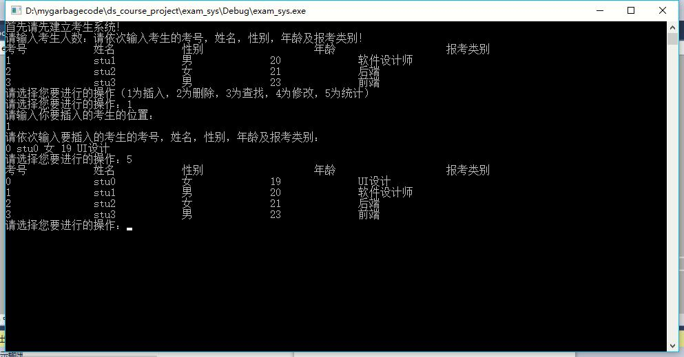
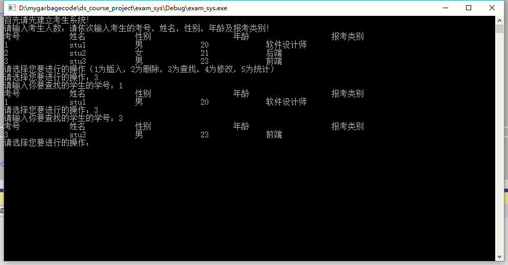
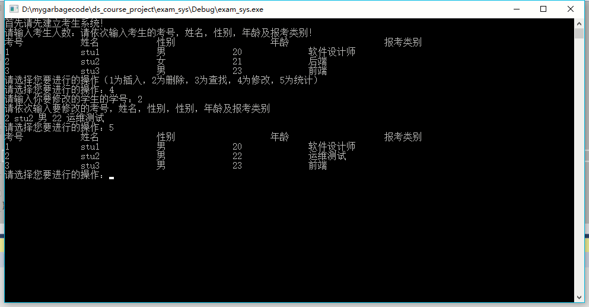
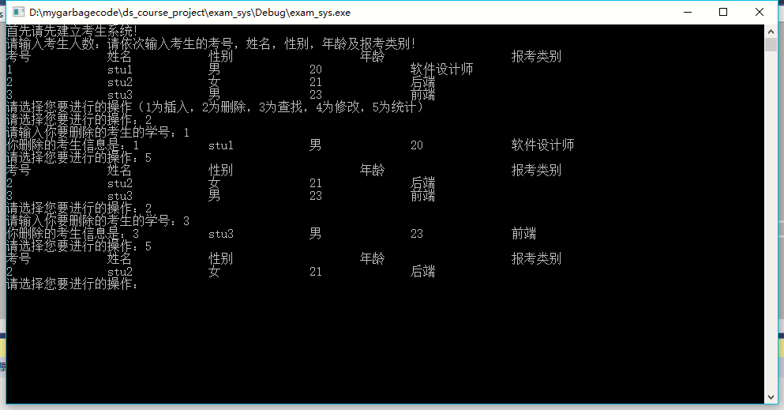
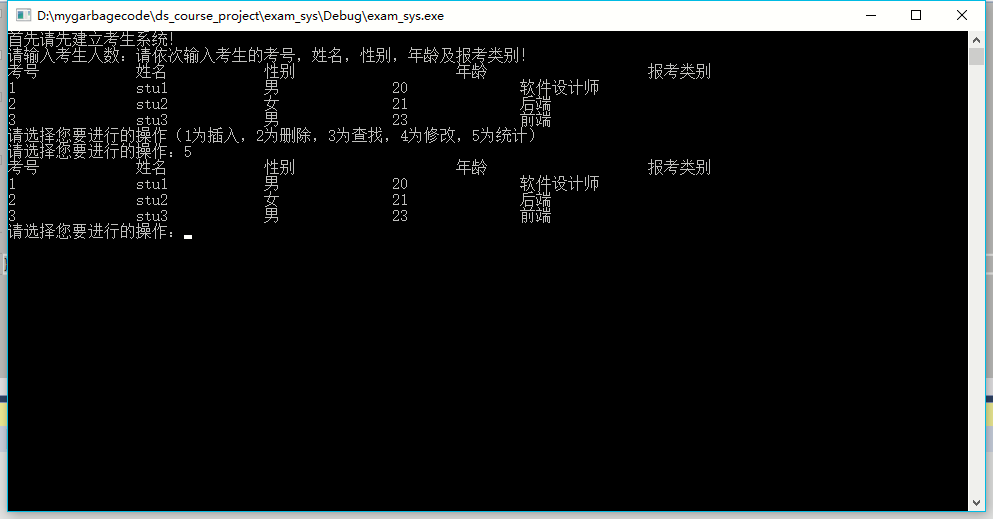
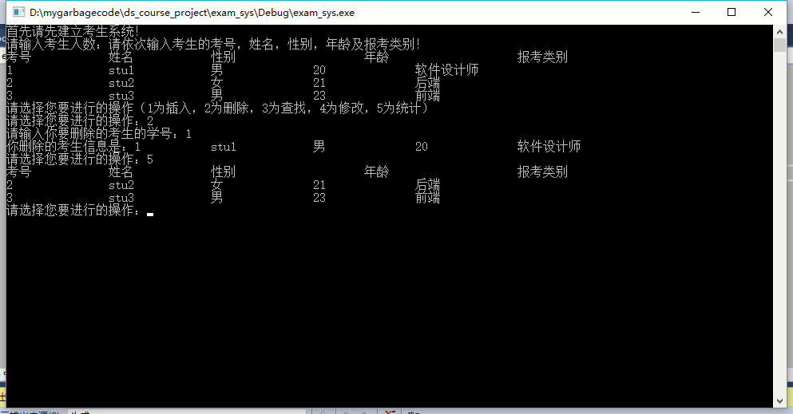
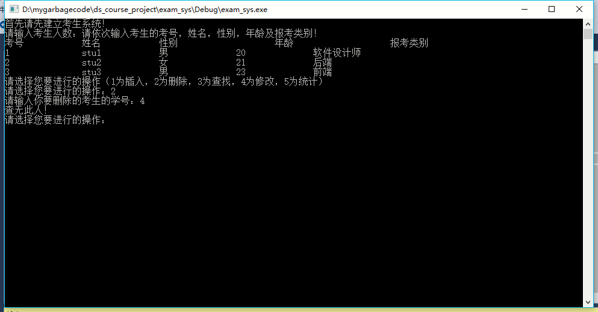
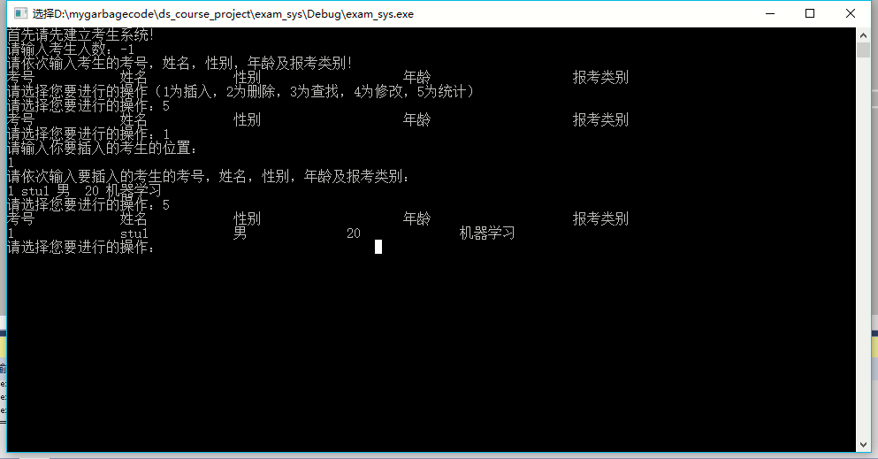

# 数据结构课程设计 项目说明文档


> ### 项目1 -- 考试报名系统
>
> 施程航
>
> 1651162


1. **项目介绍**

    - 考试报名工作给各高校报名工作带来了新的挑战，给教务管理部门增加了很大的工作量。本项目是对考试报名管理的简单模拟，用控制台选项的选择方式完成下列功能：输入考生信息；输出考生信息；查询考生信息；添加考生信息；修改考生信息；删除考生信息。

2. **整体描述**
    - 本项目的实质是完成对考生信息的建立，查找，插入，修改，删除等功能。其中考生信息包括准考证号，姓名，性别，年龄和报考类别等信息。

    - 运行环境： Windows10 && visual studio 2015

    - 代码托管平台： github

    - 项目地址： /

3. **设计概要**
    - **数据结构设计**
        - 本项目采用带表头节点的链表List作为核心数据结构，链表元素为Node类，一个Node节点代表一个学生。在这里采用带表头的链表是为了使得插入起始位置和其他位置的逻辑相同，从而不用单独讨论。
    - **类设计**
        >
        > 为了让文档看起来清晰一点，以下函数均省略参数，具体可到对应头/源文件查看。
        >
        - **节点类**
            - 节点类的主要功能是储存对应考生的具体信息，包括考号，姓名，性别，年龄，报考类别。

            - 类成员及成员函数
                >
                > typedef bool __student_sex;//在这里使用bool而不是std::string是为了节省内存，没必要杀鸡焉用宰牛刀。
                >
                > typedef student_node* student_ptr;
	            > typedef __student_sex sex_type;
                >
                | 成员 | 访问权限   | 详细描述 |
                | - | - | - |
                | int _num | public | 学生考号 |
                | std::string _name | public | 学生名字 |
                | sex_type _sex | public | 学生性别 |
                | int _age | public | 学生年龄 |
                | std::string _test_type | public | 学生报考类别 |
                | student_ptr _next | public |指向下一个节点的指针 |

                | 成员函数 | 访问权限 | 详细描述 |
                | - | - | - |
                |student_node() |public|（默认）构造函数，可根据传入参数构造新的学生节点，默认_next指针指向nullptr|

            - 辅助函数
                >
                > 由于项目里多处通过Node类成员构造Nde、输出Node类的各个成员，所以这里为<<和>>两个输入输出运算符重载了Node类，避免了代码的冗余，让代码看起来更为简洁舒适。
                >
                |辅助函数|详细描述|
                |-|-|
                |ostream& operator<< ()|重载了节点的输出运算符，输出节点就是把对应成员按一定的顺序输出|
                |istream& operator>> ()|冲在了节点的输入运算符，通过按照给定的顺序输入节点的成员即可修改节点内部数据。|
        - **链表类**
            - 链表类的主要功能是把节点组织起来，向外部提供插入、删除、查找、修改、统计功能，外部可访问的函数还有构造和析构函数，在内部还有其他私有函数。

            - 类成员及成员函数
            
                |成员|访问权限|详细描述|
                |-|-|-|
                |stu_ptr _head|private|表头节点，为了让插入空表和非空表的逻辑统一，减少代码冗余|
                
                |成员函数|访问权限|详细描述|
                |-|-|-|
                |stu_ptr do_find()|private|给定一个考生的考号，返回指向该考生的指针，被find()函数和modify()函数调用，减少代码冗余。|
                |void display_table_head()|private|打印表头信息，被show_all()函数和find()函数调用，减少代码冗余。|
                |void destroy_all()|private|做实际释放内存的工作，会删除表中的所有节点（包括表头节点），供析构函数调用，采用递归，在后续节点之后才会释放当前节点。|
                |void find()|public|根据学生考号找到对应的节点指针，并打印在屏幕|
                |void destroy()|public|根据学生考号找到对应的学生节点，展示学生信息后将对应节点删除|
                |void modify()|public|根据学生考号找到对应的学生节点，根据传入的信息进行修改。|
                |void insert()|public|根据输入信息建立新的节点，并把其插入链表中。|
                |void show_all()|public|统计所有考生的信息，将其以表格形式对齐打印。|
                |List()|public|（默认）构造函数，建立一个带有表头节点的空表。|
                |~List()|public|析构函数，释放表中所有节点的内存。|

4. **具体实现**
    - 插入功能的实现
        - 代码逻辑
            根据插入位置position向前迭代，找到合适位置后插入，修改前后节点的指向。
        - 代码
        ```c++
        void insert(Node* x, int position)
	    {
		    Node* temp = _head;
		    for (int i = 1;i < position && temp != nullptr; ++i)
		    {
			    temp = temp->_next;
		    }
		    if (temp == nullptr)
		    {
			    std::cout << "illegal position! please give another position -- " << position << std::endl;
			    //let user reinput a legal position

			    //
			    return;
		    }
		    x->_next = temp->_next;
		    temp->_next = x;
	    }
        ```
        - 测试

            
    - 查找功能的实现
        - 代码逻辑
            遍历链表，用链表节点中的考号做相等判断，若找到合适的考号则退出，否则返回空指针，并报“查无此人！”。
        - 代码
        ```c++
        //查找的实际逻辑，为了供查找和修改共同调用，抽象出来写了一个新的函数
        stu_ptr do_find(int num)
	    {
		    auto temp = _head->_next;
		    while (temp != nullptr&&temp->_number!= num)
		    {
			    temp = temp->_next;
		    }
		
			return temp;
	    }
        //
        void find(int num)
	    {
		    auto stu = do_find(num);

		    if (stu)
		    {
			    display_table_head();
			    std::cout << *stu << std::endl;
		    }
		    else {
			    std::cout << "查无此人!" << std::endl;
		    }
	    }
        ```
        - 测试
        
            
    - 修改功能的实现
        - 代码逻辑
            遍历链表，用链表节点中的考号做相等判断，若找到合适的考号则根据输入的信息进行修改，若无该考号则报“查无此人！”。
        - 代码
        ```c++
        //do_find()代码如上，在此省略。

        //modify
        void modify(int num)
	    {
		    auto stu = do_find(num);

		    if (stu)
		    {
		    	std::cout << "请依次输入要修改的考号，姓名，性别，性别，年龄及报考类别"
				<< std::endl;
			    std::cin >> *stu;
		    }
		    else {
		    	std::cout << "查无此人!" << std::endl;
		    }
	    }
        ```
        - 测试
            
    - 删除功能的实现
        - 代码逻辑
            在遍历的基础上持有两个指针，一个是实际指针，另外一个是前驱指针，前驱指针的作用是方便修改，因为本项目采用的链表是单链表，所以有前驱指针才能进行正确的删除。这个遍历的逻辑不和前面do_find()做在一起就是这个原因。
        - 代码
        ```c++
        void destroy(int num)
	    {
		    auto pre = _head;
		    auto temp = _head->_next;
		    while (temp != nullptr)
		    {
		    	if (temp->_number == num)
		    	{
		    		pre->_next = temp->_next;
			    	std::cout << "你删除的考生信息是：" <<  *temp << std::endl;
		    		delete temp;
			    	return;
		    	}
		    	else {
		    		pre = temp;
		    		temp = temp->_next;
	    		}
	    	}
	    	std::cout << "查无此人！" << std::endl;
	    }
        ```
        - 测试
            
    - 统计功能的实现
        - 代码逻辑
            先打印表头，调用display_table_head()打印表头，随后一边遍历一遍输出考生信息。
        - 代码
        ```c++
        void show_all()
	    {
		    display_table_head();
		    for (auto temp = _head->_next;temp != nullptr;temp = temp->_next)
		    {
		    	std::cout << *temp << std::endl;
		    }
	    }
        ```
        - 测试
        
5. **鲁棒性测试**
    > 
    > robust及鲁棒性的音译，意味着稳定性。是评价一个项目的重要标准。
    >

    - 良好的项目应该充分考虑边界条件，经过测试，已下情况均工作正常。

    - 删除表头节点
        

    - 删除不存在的节点
        

    - 建立系统时输入负数
        

6. **其他**
    - 为了方便开发时的调试，项目使用了重定向的手法。项目中在一开始建立系统时把标准输入重定向为data.txt（其中包含三个考生的信息，供建立系统时调用），在建立后又把标准输出重定向回来。

    ```c++
    #ifdef REDIRECT
	    streambuf *backup = cin.rdbuf();
	    ifstream fin;
	    fin.open("data.txt");
	    if (!fin)
	    {
		    cout << "文件打开失败！";
		    exit(1);
	    }
	
	    cin.rdbuf(fin.rdbuf());//重定向
    #endif	

    #ifdef REDIRECT
	    cin.rdbuf(backup);//撤销重定向
    #endif // REDIRECT

    ```