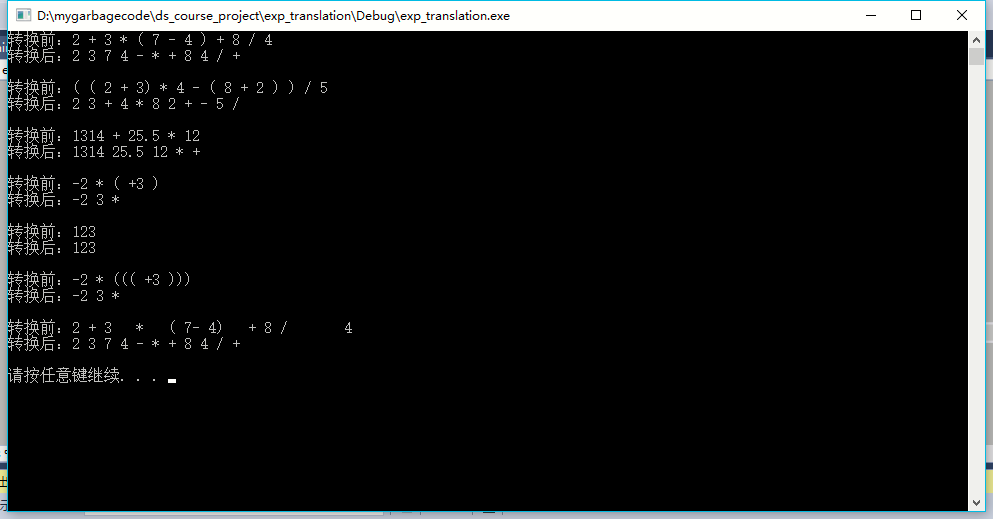

# 数据结构课程设计 项目说明文档


> ### **项目4 -- 表达式转换**
>
> 施程航
>
> 1651162


1. **项目介绍**
    - 算数表达式有前缀表示法，中缀表示法和后缀表示法等形式。日常使用的算术表达式是采用中缀表示法，即二元运算符位于两个运算数中间。此程序用于将中缀表达式转换成为后缀表达式。

2. **整体描述**
    - 输入说明：输入在一行中给出以空格分隔不同对象的中缀表达式，可包含+, -, *, /, -, *, /以及左右括号，表达式不超过20个字符（不包括空格）。
    - 输出说明：在一行中输出转换后的后缀表达式，要求不同对象（运算数，运算符号）之间以空格分隔，但是结尾不得有多余空格。
    - 测试用例：
        
        |输入|输出|说明|
        |-|-|-|
        |2 + 3 * ( 7 - 4 ) + 8 / 4|2 3 7 4 - * + 8 4 / +|正常测试6种运算符|
        |( ( 2 + 3) * 4 - ( 8 + 2 ) ) / 5|	2 3 + 4 * 8 2 + - 5 /|嵌套括号|
        |1314 + 25.5 * 12|1314 25.5 * +|运算数超过1位整数且有非整数出现|
        |-2 * ( +3 )|-2 3 +|运算数有正或负号|
        |123|123|只有一个数字|

3. **设计概要**
    - **整体说明**
        - 表达式的转换在本项目分为两部分：1.解析一个符号（该符号可能是操作符或者数字）；2.根据该符号的类型以及优先级决定是压栈还是输出。表达式只会被扫描一次，也就是说，一直重复步骤1、2直至到达表达式末尾，若此时栈中还有符号则一直输出栈顶元素并执行Pop至栈为空。
        - 采用了（类）递归下降的分析方法，将对一个expression(表达式)的解析分割成对多个符号(object)的解析，其中对单一符号的解析被封装成一个函数parse_one_object，简化了逻辑。
        - parser类对外提供的接口只有构造函数，以及一个设定表达式的setter，和执行表达式转换的translation。其他逻辑对外界不可见，减少了使用者的心智负担。
        - 简化版的[shunting yard(调度场算法)][1]算法。
    - **需要注意的地方**
        - 支持对有符号数字的解析，需将带符号的数字用"()"括起来，比如：5 * -3 -> 5 * (-3)
        - 支持表达式中任意数量(包括0)的空格 
    - **类设计**
        - 整个分析程序的逻辑被封装成一个class parser，parser 内部还有一个object struct的声明，也就是上述说的符号，一个符号是解析后的一个最小单元。

        - 成员(函数)概览

            |成员(函数)/类内声明|访问权限|具体描述|
            |-|-|-|
            |parser(std::string _exp):exp(_exp)|public|parser类的构造函数，根据传入的表达式构造paerser|
            |void translation()|public|提供给外部的转换表达式的接口，程序的主逻辑在此实现|
            |void set_exp(const std::string& _exp)|public|设置表达式，为了能让一个parser类重复使用，设置新的表达式后再执行一次translation就可以得到对应的新的表达式的输出|
            |void space_or_end()|private|判断表达式是否已经完全被解析，如果未结束则打印空格|
            |std::string exp|private|储存当前正在解析的表达式|
            |object obj|private|存储最近一次成功解析的符号，可以是数字或操作符|
            |std::stack< object >	ops|private|存储操作符的栈，扫描到一个操作符时不能马上输出，需要判断下一个符号与之的优先级高低|
            |int ptr|private|表达式的游标，指向表达式当前当前的解析位置|
            |bool last_is_lb|private|布尔变量，指明上一个符号是否为左括号|
            |bool number_prefix|private|布尔变量，当解析到一个数字后，需判断其是否拥有代表正负的前缀符号|
            |void parse_one_object()|private|从表达式当前的位置开始解析一个符号，由于一个符号可能是数字或多种操作符，多以parse_one_object选择分发到可供其调用的针对各种类型符号的函数，使程序逻辑更为清晰|
            |void parse_number()|private|解析一个数字，并将指针前移|
            |void parse_rb()|private|解析左括号，并将指针前移|
            |void parse_lb()|private|解析右括号，并将指针前移|
            |void parse_add_and_mul()|private|解析加减操作符，并将指针前移|
            |void parse_mul_and_div()|private|解析乘除操作符，并将指针前移|
            |const char OP2char[10]|private|操作符从OP类型到char的映射数组|
            |enum OP {}|private|枚举类型，表示操作符的优先级大小|
            |struct object|private|结构体声明，表示一个符号的类型及数值(或优先级)|
    - **为什么这么设计**
        - 一开始没想到用parser这个类来囊括此次项目的逻辑，而是采用全局变量+外部函数声明。受面向对象程序设计的影响，如果把一些不需要让用户知道的细节都通过class封装成private类型的内部成员或成员函数，接口看起来可能会舒服点。
        - object类在初期设计时的值域val是double类型，也就是当一个obj是一个数字时，用double去表示，这很合情合理；当一个obj是一个操作符时，将OP类型的符号优先级转换后用double表示。这样的代码不管是显式还是隐式转换，看起来有点丑，当然我们可以在obj内声明一个double和一个OP来分别表达数字的值和符号的优先级，但是这样浪费了一点内存，这时候符合我们需求的东西就是union啦。

4. **具体实现**
    - #### 符号表示
        
        ```c++
        enum OP {
		    RIGHT = 1,
		
		    ADD,
		    SUB,
		
		    MUL,
		    DIV,
		
		    LEFT,
	        };
	    const char OP2char[10] = {
		        ' ', ')', '+', '-', '*', '/','(',
	        };

	    //表达式的最小单元，数字或者操作符
	    struct object {
		    typedef union {
			    double num;
			    OP op;
		    } VAL;

		    bool isnumber;
		    VAL val;
            };
        ```
        - OP枚举类型加减的优先级分别是2和3，当我们判断两个运算符的优先级是否相等时只需处以2再比较大小即可，*/类似。
        - OP2char数组将操作符的优先级作为下标取得对应的表示char的符号，以便打印。
        - object结构体中的VAL声明是一个union，根据object的类型表示对应的数值或优先级。

    - #### 表达式转换
        ```c++

        void translation()
	    {
		    using std::cout;

		    ptr = 0;
		    last_is_lb = true;

		    //std::deque<object> output;

		    while (ptr != exp.size()) {
			    parse_one_object();

			    if (obj.isnumber) {
				    if (number_prefix) {
					    //obj.val = -obj.val;
					    assert(!ops.empty());
    
					    if (ops.top().val.op ==SUB) {
						    obj.val.num = -obj.val.num;
					        }
					    ops.pop();
					    number_prefix = false;
				        }

				    cout << obj.val.num << ' ';
			        }
			    else {
				    //处理符号
				    OP op = obj.val.op;
				    switch (op) {
				        case LEFT: {
					        ops.push(obj);
					
					        break;
				        }
				        case RIGHT: {
					        if (ops.top().val.op != LEFT)   {
						        cout << OP2char[ops.top().val.op];
						        space_or_end();

						        ops.pop();
					        }
					        assert(!ops.empty() && ops.top().val.op == LEFT);

					        ops.pop();//LEFT

					        break;
				        }
				        default: {
					        //+-*/
					        //
					        //auto top_op = ops.top().val.op;
					        while (!ops.empty()) {
						        auto last_op = ops.top().val.op;
						        if (last_op / 2 >= op / 2 && last_op != LEFT) {
							        cout << OP2char[last_op];
							        space_or_end();

							        ops.pop();
						            }
						        else break;
					            }
					        //压入新操作符
					        ops.push(obj);
				            }
				        }
			        }
		        }

		        if (!ops.empty()) {
			        cout << OP2char[ops.top().val.op];
			        ops.pop();
		            }
		        while (!ops.empty()) {
			        cout << " " << OP2char[ops.top().val.op];
			
			        ops.pop();
		            }
	            }
        ```
        - translation每次调用parse_one_object解析一个符号，然后运行shunting yard算法。得益于parse_one_object，算法只要根据新解析出来的符号继续进行分析而不用陷入解析一个符号的细节。

        - 如何解析一个带有符号的数字
            - 读到左括号，将last_is_lb置为true
            - 读到'+'/'-'，判断last_is_lb是否为true，如果为true，置number_prefix为true，表示如果下一个解析到的符号是一个数字，那么这个数字将带上当前解析的得到的正负号，如果last_is_lb为false，置last_is_lb和number_prefix为false
            - 读到一个数字，判断number_prefix是否为true，若是，则该数字带符号，此时需把栈顶的符号弹出来，并根据正负改变或保持新读到的数字的符号。否则继续进行解析
            - 读到其他符号，置last_is_lb为false


        - shunting yard 算法的流程
            >
            > 前面已经介绍如何解析一个带有正负的数字，接下来主要考虑如何实现shunting yard算法，故这里所说的数字已经是解析完成的带有正负号的数字。
            >
            - 如果已经表达式已经解析结束，则将符号栈中所有的符号pop并直接输出，算法至此结束，退出程序
            - 读到一个数字，输出。继续读入下一个符号
            - 读到一个操作符
                - 如果是右括号，pop并输出栈顶元素直到遇到第一个左括号，将左括号弹出，丢弃左括号和右括号。继续读入下一个符号
                - 如果是左括号，压入栈中。继续读入下一个符号
                - 如果是'+-*/'
                    - a.判断符号栈是否为空，若不为空，判断栈顶操作符和当前操作符的优先级大小，若栈顶元素优先级更高并且栈顶元素不为左括号，则pop并输出栈顶元素
                    - b.继续执行步骤a，直到栈为空、栈顶元素优先级小于当前操作符或者栈顶元素为左括号。此时将当前符号压入栈中。继续读入下一个符号
    - #### 分发到解析单个符号的子程序
        ```c++
        void parse_number()
	    {
		    //std::cout<<exp[ptr];
		    assert(isdigit(exp[ptr]));//确认首位为数字

		    double int_part = 0.0;
		    while (isdigit(exp[ptr])) {
			    int_part = (exp[ptr] - '0') + int_part * 10.0;
			    ++ptr;
		}
		    //如果有的话，处理小数部分
		    if (exp[ptr] == '.') {
			    double weight = 0.1;
			    ++ptr;//过滤小数点

			    while (isdigit(exp[ptr])) {
				    int_part += weight * (exp[ptr] - '0');
				    weight = weight * 0.1;

				    ++ptr;
			    }
		    }

		    obj.isnumber = true;
		    obj.val.num = int_part;
	    }
	    void parse_rb()
	    {
		    obj.isnumber = false;
		    obj.val.op = RIGHT;
		
		    ++ptr;
	    }
	    void parse_lb()
	    {
		    obj.isnumber = false;
		    obj.val.op = LEFT;

		    ++ptr;
	    }
	    void parse_add_and_mul()
	    {
		    obj.isnumber = false;
		    obj.val.op = (exp[ptr] == '+') ? ADD :SUB;

		    ++ptr;
	    }
	    void parse_mul_and_div()
	    {
		    obj.isnumber = false;
		    obj.val.op = (exp[ptr] == '*') ? MUL : DIV;

		    ++ptr;
	    }
        ```
        - 数字的解析分为整数和小数部分，按位权相加即可
        - 操作符的解析解析较为简单并且在前面已有提及，此处不再赘述

5. **鲁棒性测试**
    - 用例
		- 符号之间具有任意空格
    	- 带符号的数字被多层嵌套
	- 结果(包含正常测试和鲁棒性测试用例)
		- 可以看到，正常测试与鲁棒性测试结果均符合预期

			


[1]: https://zh.wikipedia.org/wiki/%E8%B0%83%E5%BA%A6%E5%9C%BA%E7%AE%97%E6%B3%95