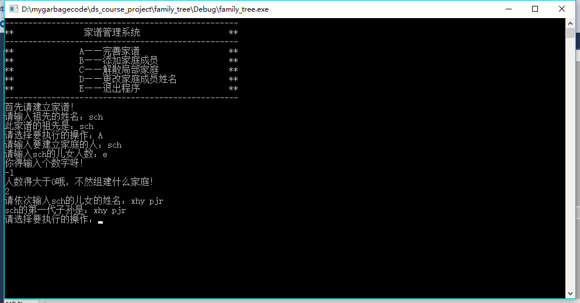

# 数据结构课程设计 项目说明文档


> ### **项目[%num] -- [%name]**
>
> 施程航
>
> 1651162


1. **需求分析**
    - **项目背景**
        - 家谱是一种以表谱形式，记载一个以血缘关系为主体的家族世袭繁衍和重要任务事迹的特殊图书体裁。家谱是中国特有的文化遗产，是中华民族的三大文献（国史，地志，族谱）之一，属于珍贵的人文资料，对于历史学，民俗学，人口学，社会学和经济学的深入研究，均有其不可替代的独特功能。本项目对家谱管理进行简单的模拟，以实现查看祖先和子孙个人信息，插入家族成员，删除家族成员的功能。
    - **项目需求**
        - 本项目的实质是完成兑家谱成员信息的建立，查找，插入，修改，删除等功能，可以首先定义家族成员数据结构，然后将每个功能作为一个成员函数来完成对数据的操作，最后完成主函数以验证各个函数功能并得到运行结果。

2. **功能分析**
    - 对于给定的输入，程序会按照操作的类型进行分发，从而实现对家谱管理系统的模拟
    - 能够跳过不正确的操作(操作指来自用户的输入)
    - 测试样例
        ```
        //测试样例1
        P0

        A
        P0
        2
        P1 P2

        A
        P1
        3
        P11 P12 P13

        B
        P2
        P21

        C
        P2

        D
        P13
        P14

        E
        ```
        - 测试结果
            
        

3. **设计概要**
    - **类设计**
        - **member类**
            - `member`是对一个具体成员的抽象，每个`member`实例指代家谱系统中的一个对象
            - **`member`成员(函数)概览**
                
                |成员(函数)|可访问性|具体描述|
                |:---:|:---:|:---:|
                |std::string name|private|成员的名字|
                |std::list< member > descendants|private|存储本成员的第一代子孙|
                |member(std::string&& _name = "")|private|移动版本的构造函数|
                |member(const std::string& _name = "")|private|复制版本的构造函数|
                |void set_name(const std::string& self_name)|private|设置成员的名字|
                |void add_a_descendant(const std::string& dsd_name)|private|增加一个该成员的第一代子孙，复制版本|
                |void add_a_descendant(std::string&& dsd_name)|private|增加一个该成员的第一代子孙，移动版本|
	            |void build_family(std::vector< std::string > dsd_names)|private|为该成员建立一个家庭|
	            |void show_descendants(bool recur)const|private|展示该成员的第一代子孙|
	            |member * const search_by_name(const std::string& name)|private|在该成员的子孙中通过名字寻找特定成员|
	            |void erase_part(const std::string& name)|private|在该成员的子孙中通过名字**递归**解散该名成员的家庭|
            - **接口设计**
                - 除了构造函数和析构函数，`member`类的其他函数均为`private`成员。外部访问`member`实质上是通过`family`来访问的，在`member`类内有`family`的友元声明`friend class family`。这样设计的原因是外部的确是不应该对`member`直接进行访问的，而是应该修改家谱的时候才对`member`进行修改。从这一角度，我们应该对用户屏蔽`member`层面的实现细节。
                - 构造函数和析构函数对外开放的原因是为了让std::list< member >能够在它所申请的内存上构造并且析构`member`实例。尝试过在`member`类内声明list< member >的友元同时将析构函数和构造函数设为`private`，放弃的原因是其实 **`list` 构造和析构元素实例是通过类外的接口实现的**，所以友元声明在此是无效的。没记错的话一般`stl`都会有自己特定的`memory allocator`，限于本人水平有兴趣的读者可以自行了解。话说回来，构造函数和析构函数对外开放可能算是设计上的一个缺陷，不过理论上用户想访问`member`还是得通过`family`这一层，所以问题也不是很大。
                - `member`类的构造函数和添加一个子孙的接口都重载了move(移动)的copy(复制)的版本，这里`copy`和`move`是指生曾一个`member`实例时是要将传入的名字(std::string)复制还是直接**夺取**其资源。在某些情况下其实参数传入后就没其他作用或者在调用结束后会离开作用域，这时候如果用`std::move()`构造`member`实例的`name`字段就可以节省**复制和释放内存**的消耗，从而提升程序性能。移动语义的测试如下：
                    ```c++
                    std::string _("??");
	                std::string __(std::move(_));

	                std::cout << "原来的字符串： " << _ << std::endl;
	                std::cout << "新构造的字符串： " << __ << std::endl;
                    ```
                    可以看到原来的字符床在移动后已经被**掏空了**：
                    
                - 通过名字在子孙中搜索特定的成员的功能通过`member * const search_by_name(const std::string& name)`接口实现，该接口作为一部分`member`其他接口或者`family`类内接口的子模块进行调用，抽象这一逻辑实现代码复用。返回类型用指针而不是引用是考虑到用户有可能输入错误或者不存在的名字，这时候如果是引用类型的话比较难表达这一搜索失败的逻辑，如果是指针类型当然可以返回空指针`nullptr`表示搜索失败。
                - 删除一个成员表达的是解散一个家庭的逻辑，前面提到说删除是递归进行的，感觉起来应该说**利用析构函数的逻辑**来进行删除比较准确。也就是说，当你解散一个局部家庭时，只需要在对应的位置将这个局部家庭的**局部祖先**删除，那么它的析构函数就会调用`descendants`也即`std::list< member >`的析构函数，`descendants`又会调用其所有元素即**局部祖先**的**下一代**子孙的析构函数，这样一层一层地调用下去，最终就能把这个家庭摧毁，一个成员都不剩...注意，如果我们没有声明`member`类的析构函数，编译器也会为我们生成**包含调用`std::list< member > descendants`析构函数**的析构函数。如果我们声明了`member`类的析构函数，那么编译器会为我们的代码进行插入使得上述逻辑正常进行。有兴趣的读者可以看看**深入探索C++对象模型**(ps:本人就看了该书的前面一小部分，所以一知半解的我在此就不班门弄斧了...)
                运行示例：
                    

                    可以看到，删除`xhy`成员后其子孙的析构函数也被调用了。
                - 显示禁止`member`类的复制构造函数。前面提到`member`的析构函数会触发其子孙(如果有)的析构函数，同样的，`member`类的复制构造函数也会一层接一层地调用其子孙的复制构造函数，而这个逻辑不需要也应该出现，因而我们用`member(const member& left) = delete;`这一声明对这一行为进行禁止。
        - **family类**
            - `family`类是对族谱的抽象，主要是对`member`类的类内接口进行调用和包装，然后提供给用户进行调用。
            - **`family`类成员(函数)概览**

                |成员(函数)|可访问性|具体描述|
                |:---:|:---:|:---|
                |member ancestor|private|该族谱的祖先|
	            |member& search_member_by_name(const std::string& name)|private|搜索族谱内对应名字的成员|
	            |family(const std::string& name):ancestor(name){}|public|通过祖先的名字构造族谱|
            	|void erase_part(const std::string& name)|public|解散指定名字的局部家庭|
	            |void add_a_descendant(const std::string& old_name, const std::string& new_name)|public|给`oldname`对应的成员加上一个名为`new_name`的下一代子孙，复制版本|
	            void add_a_descendant(const std::string& old_name, std::string&& new_name)|public|给`oldname`对应的成员加上一个名为`new_name`的下一代子孙，移动版本|
	            void build_family(const std::string& old_name, std::vector<std::string> dsd_names)|public|为族谱中`old_name`对应的成员建立家庭|
	            void show_part(const std::string& name)|public|展示族谱中对应`name`成员的局部家庭|
	            |void show_all()|public|按照辈序展示族谱的所有成员|
	            |void modify_name(const std::string& old_name, const std::string& new_name)|public|将族谱中`old_name`对应的成员的名字换为`new_name`|
    
    - **操作接口设计**
        - 程序接受来自用户对操作的选择输入，分发到对应的函数进行调用

            |命令接口|具体描述|
            |-|-|
            |void command_A(family& ft)|完善家谱|
            |void command_B(family& ft)|添加家庭成员|
            |void command_C(family& ft)|解散局部家庭|
            |void command_D(family& ft)|更改家庭成员姓名|

4. **具体实现**
    - **`member`类接口设计**
        - **建立家庭**
            ```c++
            void member::build_family(std::vector<std::string> dsd_names)
            {
	            for (auto &x : dsd_names) {
		            descendants.emplace_back(std::move(x));
	            }
            }
            ```
            根据传入的子孙名字数组建立该成员家庭
        - **展示后代**
            ```c++
            void member::show_descendants(bool recur)const
            {
	            std::cout << name << "的第一代子孙是：";
	            for (const auto& dsd : descendants) {
		            std::cout << dsd.name << " ";
		            //递归打印
		            if (recur) {
			        std::cout << "（";dsd.show_descendants(recur);std::cout << "）";
		            }
	            }
	            //std::cout << std::endl;
            }
            ```
            根据标志位`recur`决定是否递归访问子孙，若`recur`为`false`则只对下一代子孙进行访问，若为`true`则递归遍历该成员的子孙后代。
        - **寻找成员**
            ```c++
            member *const member::search_by_name(const std::string& name)
            {
	            if (this->name == name) {
		        return this;
	            }
	            for (auto& dsd : descendants) {
		            auto res = dsd.search_by_name(name);
		            if (res != nullptr)return res;
	            }

	            return nullptr;
            }
            ```
            在子孙后代中递归寻找名字字段为`name`的成员，若查找无果则返回`nullptr`
        - **解散家庭**
            ```c++
            bool member::erase_part(const std::string & name)
            {
	            assert(name != this->name);
	            for (auto it = descendants.begin();it != descendants.end();++it) {
		            if (it->name == name) {
			            descendants.erase(it);
			            return true;
		            }
		            else {
			            if (it->erase_part(name))return true;
		            }
	            }

	            return false;
                }   
            ```
            递归地在子孙中寻找解散家庭的人，找到后在`descendants`链表直接把这个子孙删除，触发其析构函数，该成员后代子孙也会被析构掉，从而完成家庭的摧毁。
        - **更改名字**
            ```c++
            void member::set_name(const std::string& self_name)
            {
	            name = self_name;
            }
            ```
    - **`family`类设计**
        - `family`类主要调用`member`的接口，进行一些包装供用户调用
        - **寻找成员**
            ```c++
            member& family::search_member_by_name(const std::string& name)
            {
	            return *(ancestor.search_by_name(name));
            }
            ```
        - **解散家庭**
            ```c++
            bool family::erase_part(const std::string& name)
            {
	            if (name == ancestor.name) {
            #ifdef LOG
		        std::cout << "满门抄斩的吗......" << std::endl;
            #endif//LOG
		        ancestor.name = "";
		        ancestor.descendants.clear();
		
		        return true;
	            }
	            else 
		            return ancestor.erase_part(name);
            }
            ```
        - **添加单个子孙**
            ```c++
            void family::add_a_descendant(const std::string& old_name,  const std::string& new_name)
            {
	            member& old = search_member_by_name(old_name);
	            old.add_a_descendant(new_name);
            }
            
            void family::add_a_descendant(const std::string& old_name, std::string&& new_name)
            {
	            member& old = search_member_by_name(old_name);
	            old.add_a_descendant(std::move(new_name));
            }
            ```
        - **建立家庭**
            ```c++
            void family::build_family(const std::string& name, std::vector<std::string> dsd_names)
            {
	            search_member_by_name(name).build_family(dsd_names);
            }
            ```
        - **展示局部家庭**
            ```c++
            void family::show_part(const std::string& name)
            {
	            search_member_by_name(name).show_descendants(false);
	            std::cout << std::endl;
            }
            ```
        - **展示家谱所有成员**
            ```c++
            void family::show_all()
            {
            	search_member_by_name(ancestor.name).show_descendants(true);
	            std::cout << std::endl;
            }
            ```
        - **修改成员名字**
            ```c++
            void family::modify_name(const std::string& old_name, const std::string& new_name)
            {
	            search_member_by_name(old_name).set_name(new_name);
            }
            ```
    - **操作命令**
        - **建立家庭操作**
            ```c++
            void command_A(family& ft)
            {
	            std::cout << "请输入要建立家庭的人：";
	            std::string name;
	            std::cin >> name;

    	        std::cout << "请输入" << name << "的儿女人数：";
	            int n = (1 >> 30);
	            std::cin >> n;
    	        while (n <= 0) {
	    	        if (!std::cin.good()) {
		    	        std::cin.clear();
			            std::cin.ignore();

    	        		std::cout << "你得输入个数字呀！" << std::endl;
	            		std::cin >> n;
	            		continue;
	    	        }
	        	    std::cout << "人数得大于0哦，不然组建什么家庭！\n";
		            std::cin >> n;
	            }
	            std::vector<std::string> new_names;
	            std::cout << "请依次输入" << name << "的儿女的姓名：";
	            for (int i = 0;i < n;++i) {
		            std::string temp;
		            std::cin >> temp;
		            new_names.push_back(std::move(temp));
	            }

	            ft.build_family(name, new_names);

    	        //std::cout << name << "的第一代子孙是：";
	            ft.show_part(name);
            }
            ```
        - **添加单个子孙**
            ```c++
            void command_B(family& ft)
            {
	            std::cout << "请输入要添加儿子（或女儿）的人的姓名：";
	            std::string old_name, new_name;
	            std::cin >> old_name;
	            std::cout << "请输入" << old_name << "新添加的儿子（或女儿）的姓名：";
	            std::cin >> new_name;

	            ft.add_a_descendant(old_name, new_name);
	
	            ft.show_part(old_name);
            }
            ```
        - **解散家庭**
            ```c++
            void command_C(family& ft)
            {
	            //std::cout << "其实我在等member的erase_part" << std::endl;
	
            	std::cout << "请输入解散家庭的人的名字：";
	            std::string name;
	            std::cin >> name;

	            std::cout << "要解散家庭的人是：" << name << std::endl;
	            ft.show_part(name);

	            ft.erase_part(name);
            }
            ```
        - **更改姓名**
            ```c++
            void command_D(family& ft)
            {
	            std::string old_name, new_name;
	            std::cout << "请输入要更改的人的目前姓名：";
	            std::cin >> old_name;
	            std::cout << "请输入更改后的姓名：";
	            std::cin >> new_name;

	            ft.modify_name(old_name, new_name);
	            std::cout << old_name << "已改名为" << new_name << std::endl;
            }
            ```
    - **读取命令**
        - 用一个`while`循环和`switch`读取命令并根据操作类型做相应的分发
        ```c++
        std::string command("init");
	    while (command[0] != 'E') {
		    std::cout << "请选择要执行的操作：";
		    std::cin >> command;
		    switch (command[0]){
		    case 'A': {
			    command_A(ft);
			    break;
		    }
		    case 'B': {
			    command_B(ft);
			    break;
		    }
		    case 'C': {
			    command_C(ft);
			    break;
		    }
		    case 'D': {
			    command_D(ft);
			    break;
		    }
        #ifdef DEBUG
		    case 'S': {
			    ft.show_all();
			    break;
		    }
        #endif
		    case 'E':
			    std::cout << "下次你还会来吗" << std::endl;
			    //no_break
		    default:
			    break;
		    }

		    //ft.show_all();
            std::cout << std::endl;
	    }
        ```
5. **鲁棒性测试**
    - **输入人数时发生错误**
        
        可以看到，程序可以很好地处理输入的数据不是整数或者整数小于0的情况

6. **TODO**
    - 在`family`类中用一个`map`类型去存每个家庭成员的名字和对应他(她)的实例的指针(或引用)，这样可以做到快速查找，提高性能，因为其实很多操作都要先查找对应的成员
    - 名字的判重，在加入一个或多个成员时，应该加入判重机制，避免重复加入相同节点，在查找时理论上是无法辨别的