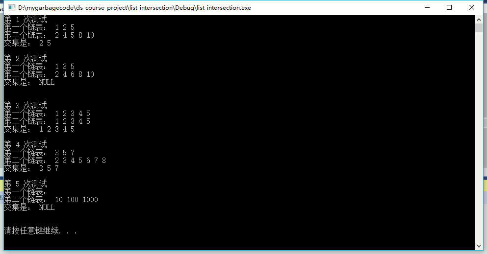
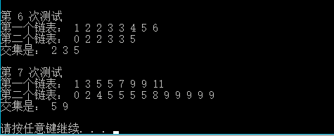

# 数据结构课程设计 项目说明文档


> ### **项目2 -- 链表交集**
>
> 施程航
>
> 1651162


1. **项目介绍**
    - 已知两个非降序链表序列S1和S2，设计函数构造出S1和S2的交集新链表S3。

2. **整体描述**
    - 输入说明：输入分2行，分别在每行给出由若干个正整数构成的非降序序列，用-1表示序列的结尾（-1不属于这个序列）。数字用空格间隔。
    - 输出说明：在一行中输出两个输入序列的交集序列，数字间用空格分开，结尾不能有多余空格；若新链表为空，输出NULL。
    - 测试用例：
        |序号|输入|输出|说明|
        |-|-|-|-|
        |1|1 2 5 -1 / 2 4 5 8 10 -1|2 5|一般情况|
        |2|1 3 5 -1 / 2 4 6 8 10 -1|NULL|交集为空的情况|
        |3|1 2 3 4 5 -1 / 1 2 3 4 5 -1|1 2 3 4 5|完全相交的情况|
        |4|3 5 7 -1 / 2 3 4 5 6 7 8 -1|3 5 7|其中一个序列完全属于交集的情况|
        |5|-1/10 100 1000 -1|NULL|其中一个序列为空的情况|
    - 运行环境： Windows10 && visual studio 2017

    - 代码托管平台： github

    - 项目地址： /


3. **设计概要**
    - **整体说明**
        - 本项目的核心数据结构是链表，由于在考试报名系统项目也是用的链表，本着Dry原则，此次链表类的设计相对比较复杂和精妙，模仿std::list的接口实现了项目所需要的核心功能。辅助类有迭代器和链表节点类。当然了，这次项目的重点还是放在链表交集的实现上。在着手项目时，我是先用std::list的接口先写出了功能正确的求交集函数，而后开始动手实现自己的list接口，减少了开发的难度。
    - **接口设计**
        - 求链表交集的函数，项目的核心部分。
            ```c++
            list_int intersection(const list_int& first_list, const list_int& second_list);
            ```
        - 链表类
            - 链表有个哨兵节点_end，使在表头插入节点与其他位置的逻辑相同，**同时链表既是双向又是环形，这样在end迭代器前插入节点就和在其他位置前插入新节点的逻辑相同，可以减少额外的判断代码和功能代码，代码看起来更加简洁。**


            |成员/成员函数|访问权限|具体描述|
            |-|-|-|
            |link_type _end|private|哨兵节点，同时作为链表尾部的标志|
            |void initial_node_ptr()|private|初始化哨兵节点的指向，方便后续的插入，供构造函数调用|
            |link_type alloc_node(int val)|private|根据值val申请内存生成新节点，供外部接口insert调用|
            |void destroy_node(link_type node)|private|释放节点的内存|
            |iterator begin()|public|返回一个指向起始节点的迭代器|
            |const_iterator begin()const|public|begin()的const版本|
            |iterator end()const|public|返回一个指向尾节点的后一节点的迭代器|
            |const_iterator begin()const|public|end()的const版本|
            |bool empty()const|public|判断链表是否为空|
            |list()|public|默认构造函数，**利用初始化列表**初始化哨兵节点|
            |template < class It > list(It begin, It end)|public|构造函数，利用一对迭代器初始化链表，此处采用**泛型**实现，故可以用有遍历功能的迭代器的容器初始化链表，包括C++的int a[]数组，主要用于测试|
            |~list()|public|析构函数，在此释放内存，保证链表类离开作用域时内存被正确释放，防止内存泄露|
            |void clear()|private|释放除哨兵节点外的其他节点的内存，可供拷贝函数和析构函数使用，抽象程一个函数可减少冗余代码|
            |template< class It > void copy(It first, It last)|private|供构造函数和拷贝函数调用，拷贝对应迭代器范围内的数值|
        - 节点类
            - 节点类的设计很简单，访问前后节点的功能放在迭代器中实现，屏蔽底层实现细节。

            
            |成员(函数)|具体描述|
            |-|-|-|
            |next|指向下一节点的指针|
            |prev|指向前一节点的指针|
            |element|节点的值|
            |_list_node(int val)|构造函数|
        - 迭代器
            - 节点和链表的中间层抽象，保护节点类的定义不直接暴露出来，对用户的使用也相对友好。

            |成员(函数)|访问权限|具体描述|
            |-|-|-|
            |bool operator==(const _list_iterator& it)const|public|通过判断两个迭代器是否指向同一节点来判断迭代器是否相等|
            |bool operator!=(const _list_iterator& it) const|public|迭代器的不等判断|
            |_list_iterator(link_type _node) :node(_node)|public|构造函数，接受一个节点构造一个指向该节点的迭代器|
            |_list_iterator& operator++()|public|前缀++，向前移动迭代器，返回**自身的引用**|
            |_list_iterator operator++(int)|public|后缀++，向前移动迭代器，返回原来迭代器的**拷贝**|
            |int& operator *()|public|返回迭代器指向的节点的值的引用|

4. **具体实现**
    - **交集函数的实现与分析**
        ```c++
        //intersection.h

        //using list_int = std::list<int>;
        using list_int = _sch::list;

        list_int intersection(const list_int& first_list, const list_int& second_list);
        ```
        - 这里用using声明了list_int，在这里我们可以用std::list也可以用自己实现的list接口，这得益于在实现intersection函数时没有依赖list的底层实现，更进一步，我们可以使用任意一个实现了所需基本功能的list接口。这就是抽象的作用。
        
        ```c++
        list_int intersection(const list_int& first_list, const list_int& second_list)
        {
	        list_int res;//result

	        if (first_list.empty())
	        {
		        return res;//返回空链表
	        }
	        else if (second_list.empty())
	        {
		    return res;
	        }
	        //两个链表均不为空
	        auto f_it = first_list.begin();
	        auto s_it = second_list.begin();

	
	        while (f_it != first_list.end() && s_it != second_list.end())
	        {
		        if (*f_it == *s_it)
		        {
			        res.insert(res.end(), *f_it);

			        auto inserted_just_now = *f_it;
			        while(f_it!=first_list.end() && *f_it==inserted_just_now)
				        ++f_it;

			        while (s_it!= second_list.end() && *s_it ==inserted_just_now)
				        ++s_it;
		        }
		        while (f_it != first_list.end() && *f_it < *s_it) {
			        ++f_it;
		        }
		        if (f_it == first_list.end())break;
		        //
		        while (s_it != second_list.end() && *s_it < *f_it) {
			        ++s_it;
		        }
	        }
	
	        return res;
            }
        ```
        - **算法的执行**
            - 开始时先默认初始化一个空链表，判断两个链表是否为空，如果有一个链表为空，直接返回一个空链表。如果两个链表均不为空，用两个迭代器分别指向链表的开头，进入循环遍历。循环时会对两个迭代器指向节点的值比较大小，这时候有两种情况：
                - 1.当两个值不相等时，用一个while循环前向移动指向较小值的迭代器，直到它的值大于或者等于另外一个迭代器指向的值。
                - 2.当两个值相等时，将该值插入结果链表，并同时前向移动两个迭代器，继续进行比较。

            - 需要指出的一点是，在我们的实现中，除了第一次进入外部的while循环，有一个循环不变量，即进入循环时，两个迭代器指向的值相等。这点很容易证明，因为两个while循环的工作就是维持这个循环不变量，当到达某个链表的结尾即跳出循环。
            - 需要注意的一点是，因为我们在内部的两个while循环均使用了* 操作符，所以在第一个while结束后应该先对first_it进行判断，如果到达末尾直接跳出循环，防止第二个while对first_it使用*操作符出现异常。

        - **算法的复杂度分析**
            - **时间复杂度**，假定两个链表的size分别为m,n，那么算法的时间复杂度为O(min(m,n))，因为当一个链表被遍历完时算法结束。
            - **空间复杂度**，我们新开了一个链表，链表的最大长度为min(m,n)+1(算上哨兵节点)，故算法的空间复杂度为O(min(m,n))。
        - **算法的常规测试**
            - 对实验要求的测试集，结果如下：
            
                
5. **鲁棒性测试**
    - 有一种比较极端的情况是两个链表均有同一元素的多个副本，这时候上述算法也应该能正确处理。比如：
    
        |输入|预期输出|
        |-|-|
        |1 2 2 3 3 4 5 6 -1/0 2 2 3 3 5 -1|2 3 5|
        |1 3 5 5 7 9 9 11 -1/0 2 4 5 5 5 5 8 9 9 9 9 9 -1|5 9|
        - 实验结果：
        
        
