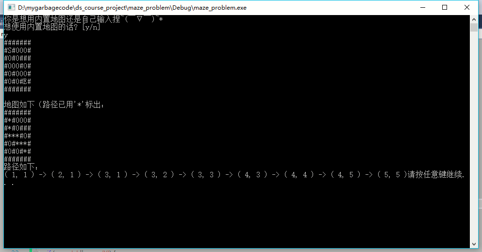
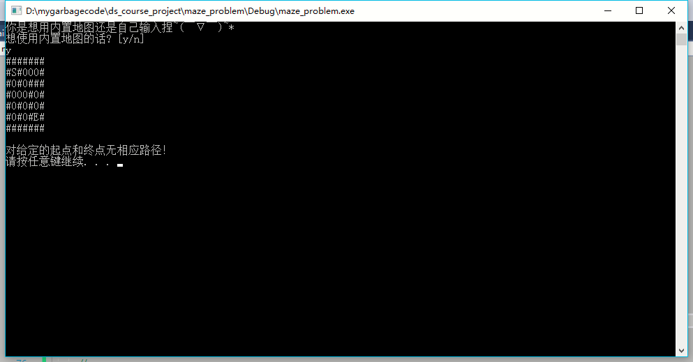

# 数据结构课程设计 项目说明文档


> ### **项目3 -- 迷宫问题**
>
> 施程航
>
> 1651162


1. **项目介绍**
    - 迷宫只有两个门，一个门叫入口，另一个门叫出口。一个骑士骑马从入口进入迷宫，迷宫设置很多障碍，骑士需要在迷宫中寻找通路以到达出口。
    - 程序可接受用户自定义的符合格式的地图或内置的地图，地图的输入格式如下：
        ```
            #######
            #S#000#
            #0#0###
            #000#0#
            #0#000#
            #0#0#E#
            #######
        ```
        
        其中S表示起点，E表示终点，#表示障碍物，0表示可通过的格点。
    - 接收输入后，若存在可行解，程序会打印出修改后的地图，地图以`*`标识出起点到终点的路径，并打印出路径的坐标（行列坐标均从0开始）。若无解则报错返回。

2. **整体描述**
    - 探索路径的算法采用`dfs`(deepest first search，深度优先搜索)实现，运用了回溯的思想。从入口出发，按某一方向向前探索，若能走通，即某处可达，则到达新点，否则探索下一个方向；若所有的方向均没有通路，则沿原路返回前一点，换下一个方向再继续试探，直到所有可能的道路都探索到，或找到一条通路，或无路可走又返回入口点。
    - dfs可采用递归或者栈模拟，此处采用`stl`的`stack`进行模拟。
    

3. **设计概要**
    - **路径格点**
        使用`using Point = std::pair< int, int >;`声明定义地图格点。
    - **迷宫**
        `maze`类是项目的核心类，它抽象了`迷宫`这一概念，内置迷宫初始化，迷宫求解和路径打印的功能。`maze`的成员(函数)设计如下：
        
        |成员(函数)|可访问性|具体描述|
        |-|-|-|
        |maze()|public|构造函数，执行内部逻辑的初始化|
        |void set_maze()|public|设置迷宫地图，从流里读入，可以是文件流或者标准输入cin|
        |void solver()|private|程序逻辑的核心，运行dfs算法，找出路径并做相应信息记录|
        |void get_solution|public|获得程序的输出，打印路径，供外部调用|
        |std::vector< std::string> map|private|存储地图的信息|
        |std::vector< std::vector<Point>> parent|private|存储节点的父节点信息，即当前节点可由哪一个节点到达|
        |std::vector< Point> path|private|存储起点到终点的路径|
        |Point end, start|private|地图的起点和终点|

4. **具体实现**
    - **寻找路径**
        ```c++
        //在迷宫中找路，设置map的路径？，还得把路径存起来
	    void solver() {
		    assert(end.first != -1 && start.first != -1);

		    static int dir[5] = { 0,1,0,-1,0 };
		    std::stack<Point> points;
		    points.push(start);
		    //dfs
		    while (!points.empty()) {
			    const auto top = points.top();
			    points.pop();

			    if (top.first == end.first&&top.second == end.second) {
        #ifdef DEBUG
				    std::cout << "search done!";
        #endif
				    break;
			    }
			    for (int i = 0;i < 4;++i) {
				    int x = top.first + dir[i], y = top.second + dir[i + 1];
				    if (x < 0 || x >= map.size() || y<0 || y >= map[0].size())continue;
				    if ((map[x][y] == '0' || map[x][y] == 'E')&&parent[x][y].first == -1) {
					    parent[x][y] = top;
					    points.emplace(x,y);
				    }
			    }
		    }
		//
		
	    }
        ```
        - 在solver函数内部有个局部的栈points，它存储接下来可能会探索的点。
        - **算法执行**
            - 当未到达终点并且栈已经为空，搜索失败
            - 栈不为空，取出栈顶点`top`，若`top`为终点，搜索成功。
            - 若`top`不为终点，把`top`弹出，将`top`四个方向的点中，未曾访问过并且可以通过的点压入栈中，并设置`parent`二维数组他们的父节点即`top`的信息。
    - 根据搜索得到的信息修改地图和计算路径
        ```c++
        void get_solution() {
		    solver();
		    //打印设置完的地图和路径
		    auto cur = end;
		    while (cur != Point(-1, -1)) {
        #ifdef DEBUG
			    std::cout << "( " << cur.first << ", " << cur.second << " ) ";
        #endif // DEBUG
			    path.push_back(cur);
			    map[cur.first][cur.second] = '*';
			    cur = parent[cur.first][cur.second];
		    }
		    std::cout << std::endl;
		    std::cout << "地图如下（路径已用'*'标出：" << std::endl;
		    for (auto x : map)std::cout << x << std::endl;
		    //
		    std::cout << "路径如下：" << std::endl;
		    if (path.empty()) {
			    std::cout << "对给定的起点和终点无相应路径！" << std::endl;
			    return;
		    }
		    //else
		    for (auto it = path.rbegin();it != path.rend();++it) {
			    std::cout << (it == path.rbegin() ? "" : " -> ");
			    std::cout << "( " << it->first << ", " << it->second << " )";
		    }
	    }
        ```
        
        - 根据`parent`数组将地图中对应路径的格点设为`*`，达到路径的可视化，并将路径存进`path`路径数组中。
        - 打印地图，由于节点的进入`path`数组的顺序跟前进顺序相反，故需要倒序输出。
        - 样例测试：
            ```
            #######
            #S#000#
            #0#0###
            #000#0#
            #0#000#
            #0#0#E#
            #######
            ```
            - 输出：
            

    - 根据输入初始化地图和父节点数组
        ```c++
        void set_maze(std::istream& in) {
		    std::string row;
		    while (in >> row)
		    {
			    //in >> row;
        #ifdef DEBUG
			    std::cout << row << std::endl;
        #endif
    			map.push_back(row);
		    }

		    //先找到起点和终点
		    //std::stack<Point> candidates;
		    for (int r = 0;r<map.size();++r)
			    for (int c = 0;c < map[0].size();++c) {
				    if (map[r][c] == 'S')start = Point(r, c);
				    else if (map[r][c] == 'E')end = Point(r, c);
			    }
		    parent.assign(map.size(), std::vector<Point>(map[0].size(), Point(-1, -1)));
	    }
        ```
        - 存入地图的同时记录起点和终点的位置信息，并将父节点数组全部初始化为(-1, -1)，父节点数组还可作为判断该格点是否已经被访问，只需进行判断 `parent[ cur.first ][ cur.second ].first == -1`，即当父节点未被设置过，代表节点未被访问过，并且节点的父节点只会被设置一次。

5. **鲁棒性测试**
    - 输入地图无解时：
        ```
            #######
            #S#000#
            #0#0###
            #000#0#
            #0#0#0#
            #0#0#E#
            #######
        ```
        - 输出：
        
