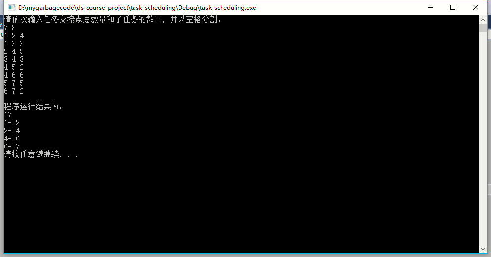
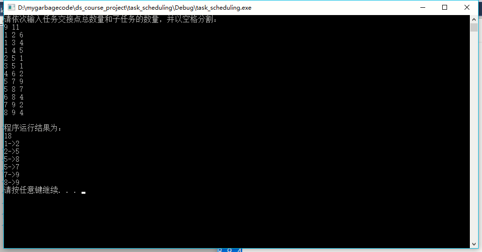
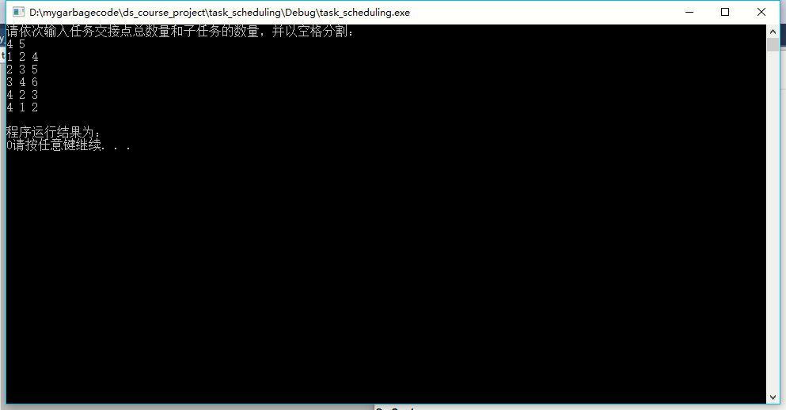

# 数据结构课程设计 项目说明文档


> ### **项目9 -- 关键活动**
>
> 施程航
>
> 1651162


1. **需求分析**
    - **项目背景**
        本实验项目是要求在任务调度问题中，如果还给出了完成每个字任务需要的时间，则可以算出完成整个工程项目需要的最短时间。在这些子任务中，有些任务即使推迟几天完成，也不会影响全局的工期；但是有些任务必须准时完成，否则整个项目的工期就要因此而延误，这些任务叫做“关键活动”。
    - **项目需求**
        - 请编写程序判定一个给定的工程项目的任务调度是否可行；如果该调度方案可行，则计算完成整个项目需要的最短时间，并且输出所有的关键活动。

2. **功能分析**
    - 输入说明：输入第1行给出两个正整数N(N<=100)和M，其中N是任务交接点(即衔接两个项目依赖的两个子任务的结点，例如：若任务2要在任务1完成后才开始，则两个任务之间必有一个交接点)的数量，交接点按1～N编号，M是字任务的数量，依次编号为1～M。随后M行，每行给出3个正整数，分别是该任务开始和完成设计的交接点编号以及完成该任务所需要的时间，整数间用空格分隔。

    - 输出说明：如果任务调度不可行，则输出0；否则第一行输出完成整个项目所需要的时间，第2行开始输出所有关键活动，每个关键活动占一行，按照格式“v->W”输出，其中V和W为该任务开始和完成涉及的交接点编号。关键活动输出的顺序规则是：任务开始的交接点编号小者优先，起点编号相同时，与输入时任务的顺序相反。如下面测试用例2中，任务<5，7>先于任务<5，8>输入，而作为关键活动输出时则次序相反。

    - 测试样例
        |序号|输入|预期输出|描述|
        |-|-|-|-|
        |1|7 8<br>1 2 4<br>1 3 3<br>2 4 5<br>3 4 3<br>4 5 2<br>4 6 6<br>5 7 5<br>6 7 2|17<br>1 –>2<br>2 –>4<br>4 –>6<br>6 –>7|简单情况测试|
        |2|9 11<br>1 2 6<br>1 3 4<br>1 4 5<br>2 5 1<br>3 5 1<br>4 6 2<br>5 7 9<br>5 8 7<br>6 8 4<br>7 9 2<br>8 9 4|18<br>1 –>2<br>2 –>5<br>5 –>8<br>5 –>7<br>7 –>9<br>8 –>9|一般情况测试，单个起点和单个终点|
        |3|4 5<br>1 2 4<br>2 3 5<br>3 4 6<br>4 2 3<br>4 1 2|0|不可行的方案测试|
    - ### **实质分析**
        - 项目实质上是让我们给活动**按照依赖关系排序**并计算出最小总时间，如果无环形依赖则调度成功，否则失败。关键路径实质上是指从起点到终点的**耗时最长**的路径，假设耗时为`T`,那么只要完成了关键路径上的子任务，那么其他任务必定能在时间`T`内完成。
        - **要点**：
            - 程序最终实现的是对一个给定的有向图，寻找从起点到终点的所有最长路径，且要能判断求图是否无环
            - 判断有无环形依赖
            - 关键路径可能**不止一条**，需要输出所有关键路径
            - 关键路径输出的顺序

3. **设计概要**
    - **类设计**
        - **`Task`**
            一个`Task`结构体的实例表示一个一个子任务
            - `Task`成员(函数)概览

                |类成员(函数)|具体描述|
                |-|-|
                |int from|起始交接点|
                |int to|终止交接点|
                |int cost|到下一跳或终点的花费|
                |int input_num|输入时的编号，标记顺序，当有多个关键路径需要逆序输出|
                |bool operator<(const Task& right)|实现`Task`类的比较函数，便于后续按照规定的顺序输出|
                |Task(int _from, int _to, int _cost, int _input_num)|构造函数|

        - **`solver`类
            实现程序的主要逻辑
            - `solver`类成员(函数)概览
                |类成员(函数)|可访问性|具体描述|
                |-|-|-|
                |int n|private|交接点总数量|
	            |std::vector< std::vector< Task > > subtasks|private|记录子任务的首尾交接点和所需时间|
	            |std::vector< Task > key_tasks|private|记录关键活动|
                |std::vector< std::vector< Task > > sons|private|存储关键路径的信息|
	            |std::vector< int > visited|private|判断有无环形依赖|
	            |std::vector< int > final_costs|private|记录该点到终点的耗时|
	            |void output_key_tasks()|private|打印关键活动|
	            |int dfs(int cur)|private|深度优先搜索关键路径|
	            |void accept_input(std::istream& in)|public|接受输入|
	            |void run()|public|运行程序主逻辑，打印关键路径|
	            |void search_key_path(int cur = 1)|private|根据记录关键路径的`sons`数组，递归地记录最终要打印的结果|

4. **具体实现**
    - 接受输入
        ```c++
        void solver::accept_input(std::istream& in)
        {
            using std::cin;
            using std::cout;

            int m;
            cin >> this->n >> m;

            assert(this->n > 1);
            //++n;
            subtasks.assign(n + 1, std::vector<Task>());
            sons.assign(n + 1, std::vector<Task>());
            visited.assign(n + 1, 0);
            final_costs.assign(n + 1, -1);

            for (int i = 0;i < m;++i) {
                int from, to, value;
                cin >> from >> to >> value;
                subtasks[from].emplace_back(from, to, value, i);
                }
        }
        ```
        接受输入后根据`n`的大小初始化各个数组，应当注意的是下标从0开始，为了后续方面多开了一个单位的空间

    - **深度优先搜索关键路径**

        这是该程序的核心逻辑，大概也是最复杂的一部分。主要实现了以下功能：

        - 判断是否存在**环形依赖**的任务
            判断环形依赖其实就是**判断有向图是否存在环路**，跟`拓扑排序`的思想类似，一个交接点有以下状态，通过`enum`枚举实现：
            ```c++
                enum POINT_STATE {
                    INITIAL = 0,
                    PERMERNANT,
                    VISITED,
                };
            ```
            在到达一个节点时，如果其状态为`VISITED`，那么可以断定存在环路。在每次对一个子节点进行访问时我们会将其状态标识为`VISITED`，在递归访问完其子节点后我们会将其标志置为`PERMERNANT`代表我们不会再去访问它，如果到达一个节点时其状态为`VISITED`说明我们从它的子节点又绕回到它本身，即存在环路。

        - **记忆化**的深度优先搜索

            我们可以注意到枚举类`POINT_STATE`有一种状态称为`PERMERNANT`，就是代表**从这个节点开始经过其所有子节点到达终点的所有路径我们均已访问过**，后续再次到达这个节点我们只需要取出第一次记录的信息即可，存储该节点信息的数组是`final_cost`

            `dfs`有一个返回值，记录其从某个子节点出发到达终点的具体信息，通过`enum`枚举实现，定义如下：
            ```c++
            enum PATH_KEY{
                CIRCULAR = -2,//环形依赖
                NOPATH,//没有到达终点的路径
                END,//到达终点
                };
            ```
            如何判断是否是环路前面已经说过，此处不再赘述。要注意的一点是到达终点后如果从终点出发的路径不为空，那么需要继续前进判断是否出现环路。事实上本人认为在这种情况下不需继续前进也可以判断出现不符合活动调度的规则，因为**理论上终点的出度应该为0**

            如果到达某个非终点的节点并且已经无法继续前进，那么`dfs`返回`NOPATH`状态。

            如果到达终点并且终点无法继续前进，那么返回`END`

            如果返回一个不为`PATH_KEY`枚举的状态，那么该子节点不是终点并且存在一条从该子节点到达终点的路径，且耗时为其`dfs`返回值

            可以看到，`CIRCULAR`状态会通过`dfs`的返回传递给父节点；同样，如果所有子节点的`dfs`均返回`NOPATH`，那么其自身的`dfs`返回`NOPATH`

            这里还有一个难点是如何记录关键路径的信息，首先有一个前提是：我们必须访问完一个节点**到达终点的所有路径**，这样我们才能判断哪条是**关键路径**，因此在第一次访问时我们无法确定一个子任务即有向图的一条边是否在关键路径，故在一次`dfs`返回后应该记录下这条子路径的信息，这里通过存储在`sons`数组中实现，访问完所有路径后，我们再从`sons`中拿出所有耗时最长的路径即关键路径即可

        具体实现如下：
        ```c++
        int solver::dfs(int cur = 1)
        {
            if (visited[cur] == PERMERNANT) {
            return final_costs[cur];
            }
            //judge if the current point has been visited
            else if (visited[cur] == VISITED) {
            //环形依赖...
            return CIRCULAR;
            }
            else if (cur == n) {
            if(subtasks[cur].empty())
                return END;
            //else return CIRCULAR;
            }
            else if (subtasks[cur].empty()) {
                return NOPATH;
            }
            //还要继续递归搜索

            //设置访问标志
            visited[cur] = VISITED;

            int key_path_len = NOPATH;
            std::vector<Task > key_path_infos;
            for (auto& subtask : subtasks[cur]) {
                //key_tasks.push_back(subtask);
                int cost = dfs(subtask.to);

                if (cost == CIRCULAR)return CIRCULAR;//环形依赖

                cost += subtask.cost;
                key_path_infos.emplace_back(subtask.from, subtask.to, cost, subtask.input_num);
                if (cost > key_path_len)key_path_len = cost;
            }
            //清除访问标志
            visited[cur] = PERMERNANT;
            final_costs[cur] = key_path_len;

            if (key_path_len == NOPATH) {
                return NOPATH;
            }
            for (auto &x : key_path_infos) {
                if (x.cost == key_path_len) {
                    sons[cur].push_back(x);
                    //key_tasks.push_back(std::move(x));
                }
            }
            return key_path_len;
        }
    - **生成关键路径**

        从起点出发根据`dfs`记录的关键路径信息递归生成关键路径
        ```c++
        void solver::search_key_path(int cur)
        {
            if (cur == n)return;

            for (auto &son: sons[cur]) {
                key_tasks.push_back(son);
                search_key_path(son.to);
            }

        }
    - **打印关键路径**
    
        在打印路径前要进行排序，程序对关键路径不止一条时的输出顺序是有规定的，当出发点相同时按照输入的相反顺序输出，这也就是我们的`Task`有`input_num`字段的原因
        ```c++
        //打印关键路径
        void solver::output_key_tasks()
        {
            //sort()?
            std::sort(key_tasks.begin(), key_tasks.end());
            for (auto& task : key_tasks) {
                std::cout << task.from << "->" << task.to << std::endl;
            }
        }
    - **运行程序**

        外部调用程序运行的接口
        ```c++
        void solver::run()
        {
            int key_path_len = dfs();
            if (key_path_len < 0) {
                std::cout << 0;
            }
            else {
                std::cout << key_path_len << '\n';

        #ifdef DEBUG
            for (auto &ssons : sons) {//single
                for (auto&son : ssons) {
                    std::cout << son.to << " ";
                }
                std::cout << std::endl;
            }
        #endif // DEBUG
        //找出关键路径
            search_key_path(1);

            output_key_tasks();

            }
        }
        ```
5. **功能测试**
    - 测试样例结果
        - 简单情况测试

            

        - 一般情况测试

            

        - 不可行的方案测试

            

    可以看到，对于所给测试样例，程序均能正确给出结果